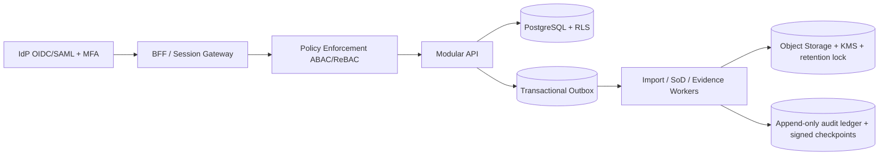

# Auditoría técnica integral de Attest

**Fecha:** 2026-08-08  
**Alcance:** `docs/CANONICAL-SPEC.md`, `server.js`, `routes/`, `stores/`, `public/`, `scripts/`, `Dockerfile`, `fly.toml`, `package.json` y documentación de despliegue.  
**Nota de gobernanza:** la ruta solicitada `/docs/canonical-specs` no existe. Se auditó `docs/CANONICAL-SPEC.md`, que se autodeclara canónico.  
**Contexto de ciclo de vida confirmado por el propietario:** Attest sigue en desarrollo; no existen clientes ni datos reales. Las identidades, correos, nombres y registros sembrados son sintéticos y se necesitan para probar todos los flujos tanto en desarrollo como sobre la infraestructura desplegada. La prioridad actual es mejorar el producto; la formalización y separación operativa de ambientes se aplaza hasta el gate final de lanzamiento.

---

# Parte 1: Concepto arquitectónico y críticas

## 1. Dictamen ejecutivo

**Estado actualizado: apta para continuar desarrollo, demos y pruebas con datos sintéticos. La preparación formal para lanzamiento se evaluará al terminar los puntos funcionales del roadmap.**

Attest es hoy un prototipo visual y funcional con una base útil para demostrar flujos. Es razonable seguir desplegándolo y probándolo como se hace actualmente. El esfuerzo inmediato debe dirigirse a que los flujos funcionen correctamente y a corregir los límites estructurales que afectan el comportamiento de la aplicación:

- El aislamiento entre tenants puede eludirse y muchas consultas ni siquiera intentan aplicarlo.
- `auditor` y `approver` se convierten efectivamente en administradores.
- El seed, sus cuentas y sus credenciales conocidas son una herramienta de desarrollo aceptada en esta etapa; no se propone cambiarlos ahora.
- El servidor acepta una decisión de certificación arbitraria sin validar la acción, el acknowledgement ni la justificación.
- El motor SoD confunde “roles bajo responsabilidad de un aprobador” con “roles efectivamente asignados a una persona”. Sus conflictos no prueban una violación SoD real.
- El “audit log inmutable” es una tabla SQLite ordinaria, mutable y con pérdida del tenant.
- La evidencia calificada como “tamper-proof” carece de hashes, firma, almacenamiento WORM, snapshot reproducible y completitud garantizada.
- Las páginas críticas tienen estados `loading` que no terminan ante fallos de red/API.
- La promesa WCAG AAA es mediblemente falsa; en Dark Mode existen filas con texto casi blanco sobre fondo casi blanco.

Esto no es una discrepancia marginal entre documentación e implementación. En multi-tenancy, RBAC, SoD, evidencia y auditoría, **la especificación y el código son simultáneamente defectuosos**.

### Decisión explícita de priorización

Durante el desarrollo se acepta conscientemente mantener el despliegue, seed implícito, cuentas ficticias y recursos actuales sin invertir ahora en:

- clasificación formal mediante `APP_STAGE`;
- banners de entorno;
- comando especial, auditoría o reset del seed;
- allowlist/VPN temporal;
- separación anticipada de DB, buckets, dominios, secrets o telemetría.

Esos controles se trasladan íntegramente a la Fase 6 de lanzamiento. Hasta entonces, el supuesto de trabajo es que todos los datos continúan siendo sintéticos. La seguridad que sí permanece en el roadmap inmediato es la que también constituye **funcionalidad central del producto**: aislamiento multi-tenant correcto, autorización por rol, validación de comandos, manejo de errores y consistencia de APIs.

## 2. Evidencia reproducible obtenida

Se levantó una instancia aislada con base SQLite temporal y `NODE_ENV=production`; no se tocaron datos del repositorio.

| Prueba | Resultado observado |
|---|---|
| Comportamiento del seed en runtime de producción | `admin.one@attest.local / password123` y `auditor.one@attest.local / password123` devolvieron HTTP 200. Es el comportamiento de desarrollo esperado y no requiere cambio en la fase actual. |
| Escalación RBAC | El login de `auditor` devolvió `isAdmin: true`; `/api/admin-users` respondió HTTP 200. |
| Cambio de tenant sin membresía | El auditor cambió a un tenant recién creado y `/api/me` reportó simultáneamente `role: auditor` e `isAdmin: true`. |
| Escritura en tenant incorrecto | Creando una campaña desde el token del tenant B, la respuesta almacenó `tenant_id: default`. |
| Lectura cruzada | Desde tenant B, `GET /api/campaigns` devolvió campañas de `default`. |
| Inyección de contexto | Un JWT de `default` más `X-Tenant-ID: tenant-B` hizo que `/api/me` reportara tenant B. |
| API keys | Una key recién creada produjo HTTP 401 al acceder a `/api/dashboard/stats`. |
| Estado de campaña | `DELETE /api/campaigns/camp_sox_q3` eliminó una campaña activa con HTTP 200. |
| Validación de decisión | `action: UNRECOGNIZED_ACTION`, sin acknowledgement ni motivo, se guardó con HTTP 200. |
| Configuración | Guardar `sso_oidc=true` produjo `{ "key": "sso_oidc", "value": true }`; la preferencia esperada nunca existe. |
| Fallo asíncrono | Al abortar `/api/campaigns`, quedaron tres skeletons indefinidamente y apareció `Failed to fetch` no manejado. |
| Dark Mode | En Reviews se midió fila `rgb(254,242,242)` con texto `rgb(241,245,249)`. |
| Dependencias | `npm audit` encontró 4 vulnerabilidades: 1 alta directa (`xlsx`), 2 moderadas y 1 baja. |

La revisión visual recorrió las 14 vistas autenticadas en tema oscuro a 1440×900. No se detectó overflow horizontal global en ese viewport; sí se confirmó el defecto de contraste inline de Reviews y la inconsistencia de scrollbars/controles.

## 3. Disenso arquitectónico frente a la especificación

### 3.1 Multi-tenancy: discrepo con la especificación y el código

La especificación ordena priorizar `X-Tenant-ID` sobre el tenant del JWT (`docs/CANONICAL-SPEC.md:477-495`). Eso convierte un dato controlado por el cliente en contexto de autorización. No debe corregirse “validando mejor el header”; debe eliminarse del flujo de usuarios finales.

El contexto correcto es:

1. autenticar el principal;
2. resolver una membresía activa `(principal, tenant)`;
3. autorizar la acción y el recurso;
4. crear un `TenantContext` inmutable;
5. obligar a repositorios, queries, cache keys, jobs y object keys a recibir ese contexto.

Un header de override sólo sería aceptable para una ruta operativa separada, con credencial de servicio o privilegio platform-superadmin, allowlist de finalidad, reautenticación y evento de auditoría explícito. OWASP recomienda derivar el tenant de claims verificados, no confiar en headers/parámetros del cliente y aplicar aislamiento también en la base de datos: [OWASP Multi-Tenant Security](https://cheatsheetseries.owasp.org/cheatsheets/Multi_Tenant_Security_Cheat_Sheet.html).

Para una plataforma GRC empresarial propongo PostgreSQL con Row-Level Security como defensa en profundidad. Si se mantiene SQLite durante una etapa local/demo, el producto debe declararse single-tenant y no exponer switching ni claims multi-tenant.

### 3.2 Identidad y sesión: la especificación institucionaliza una mala decisión

Guardar un JWT de 24 horas en `localStorage` (`docs/CANONICAL-SPEC.md:458-475`) amplía el impacto de cualquier XSS y no ofrece revocación, rotación ni control de sesión empresarial. La alternativa es:

- OIDC Authorization Code + PKCE con IdP corporativo, MFA y grupos;
- patrón BFF o sesión opaca en cookie `HttpOnly; Secure; SameSite`;
- timeout de inactividad, lifetime absoluto, revocación y device/session inventory;
- SCIM o provisioning explícito de membresías;
- políticas ABAC/ReBAC: tenant, relación con campaña, capacidad, estado del recurso y separación platform-admin/tenant-admin.

OWASP desaconseja almacenar identificadores de sesión en `localStorage`: [HTML5 Security](https://cheatsheetseries.owasp.org/cheatsheets/HTML5_Security_Cheat_Sheet.html) y [Session Management](https://cheatsheetseries.owasp.org/cheatsheets/Session_Management_Cheat_Sheet.html).

### 3.3 El modelo de dominio no soporta lo que el producto afirma hacer

El modelo actual certifica un `role_name` asociado a un aprobador. No modela, como entidades estables:

- persona/subject;
- cuenta en sistema fuente;
- entitlement/permiso;
- asignación efectiva persona-cuenta-entitlement;
- owner/reviewer;
- review item congelado dentro de una campaña;
- decisión versionada e historial de correcciones.

Por tanto, no puede demostrar “quién tenía qué acceso, en qué sistema, durante qué ventana, quién lo revisó y sobre qué snapshot”. También invalida el motor SoD: poseer responsabilidad sobre dos roles no significa tener ambos accesos.

El núcleo mínimo debería ser:

```text
Identity ──< Account ──< EntitlementAssignment >── Entitlement ── Application
                           │
Campaign ──< ScopeSnapshot ──< ReviewItem ──< DecisionEvent
                           │
                           └──< SoDEvaluation ──< Mitigation/RiskAcceptance
```

Cada campaña debe congelar su alcance, assignments, owners, política SoD y hashes de fuentes. Una recarga de Excel no puede cambiar retroactivamente el universo revisado.

### 3.4 SQLite y filesystem: aceptables para demo, no como arquitectura enterprise

WAL mejora concurrencia de lectura, pero no entrega alta disponibilidad, RLS, réplica multi-región, restore puntual, separación de funciones, KMS ni gobernanza de retención. Un volumen Fly local también impide escalar horizontalmente con seguridad.

Visión objetivo:



No recomiendo microservicios prematuros. Un **modular monolith** con límites de dominio claros, PostgreSQL y workers es suficiente y más operable.

### 3.5 “Tamper-proof” e “immutable” son afirmaciones materialmente incorrectas

El ZIP puede borrarse o reemplazarse en disco. `MANIFEST.txt` no contiene checksums ni firma. El registro puede actualizarse directamente. El paquete de una campaña incluye hasta 500 submissions generales, no necesariamente las de esa campaña. Esta evidencia no es defendible ante un auditor.

Diseño requerido:

- event log append-only con prohibición DB de `UPDATE/DELETE` para el rol de aplicación;
- hash encadenado o Merkle batch y checkpoint firmado por KMS;
- objeto con SHA-256, firma separada, retention lock/WORM y versioning;
- manifest JSON canónico con digest de cada artefacto, schema version, tenant, campaña, snapshot, generador y reloj confiable;
- generación asíncrona e idempotente;
- descarga y share access auditados;
- verificador independiente del paquete.

### 3.6 Offline-first: no es una prioridad segura para este flujo

La especificación presenta offline-first como virtud. En una certificación GRC, permitir decisiones offline exige resolución de conflictos, protección local, expiración del scope y garantía de que la política/snapshot no cambió. Nada de eso existe. La implementación sólo cachea shells estáticos y no las APIs, así que tampoco ofrece una experiencia offline funcional.

Recomiendo network-required para decisiones y mutaciones. Puede conservarse una shell resiliente y una página de error offline, pero no debe prometerse operación offline hasta diseñar sincronización e integridad.

### 3.7 View Transitions: el CSS moderno debe ganar; el interceptor JS debe salir

`@view-transition { navigation:auto }` es suficiente para navegación cross-document soportada. El wrapper `document.startViewTransition(() => location.href=...)` mezcla el modelo same-document con una MPA y duplica la responsabilidad. Mantener progressive enhancement sólo en CSS simplifica navegación, accesibilidad y apertura en nueva pestaña.

### 3.8 La arquitectura frontend está fragmentada

Existen al menos cuatro paradigmas simultáneos:

- Web Components compartidos;
- scripts inline por página;
- scripts externos por página;
- utilidades globales y monkey-patching de `window.fetch`.

La solución no requiere migrar inmediatamente a React/Vue. Propongo módulos ES con:

- `apiClient` único, timeout, `response.ok`, error envelope y manejo 401;
- controladores por vista con estado discriminado `loading | success | empty | error`;
- componentes accesibles para modal, tabla, empty/error state, tenant switch y toast;
- render seguro con DOM APIs; `innerHTML` sólo para templates estáticos;
- CSS por tokens semánticos y componentes, sin estilos inline.

### 3.9 La especificación visual usa el vocabulario correcto, pero los valores no cumplen su propia ley

La promesa AAA exige 7:1 para texto normal. Contrastes medidos:

| Par | Ratio aproximado | Resultado |
|---|---:|---|
| `--warning` sobre `--warning-light` (light) | 3.07:1 | Falla AA/AAA para texto normal. |
| `--danger` sobre `--danger-light` (light) | 4.41:1 | Falla AA por poco; falla AAA. |
| `--success` sobre `--success-light` | 3.58:1 | Falla AA/AAA. |
| `--accent` sobre `--accent-light` | 3.54:1 | Falla AA/AAA. |
| Blanco sobre botón `--accent` | 3.68:1 | Falla AA para texto normal. |
| `--text-tertiary` light sobre blanco | 2.56:1 | Falla AA/AAA. |
| Reviews dark, texto sobre fondo inline claro | ~1.06:1 | Ilegible. |

W3C define 7:1 para AAA normal y 4.5:1 para AA normal: [WCAG 2.2, Contrast Enhanced](https://www.w3.org/WAI/WCAG22/Understanding/contrast-enhanced.html).

El rediseño debe separar `color` de estado (icono/borde) y `color` de texto. No se debe usar el mismo token saturado para texto pequeño y fondo de botón.

## 4. Matriz de contradicción: especificación vs. código

| Tema | Especificación | Código real | Qué debe ganar |
|---|---|---|---|
| Fuente canónica | `/docs/canonical-specs` según solicitud | Sólo existe `docs/CANONICAL-SPEC.md` | Renombrar/normalizar y añadir owner, versión, ADRs y revisión. |
| Tenant header | Prioridad a `X-Tenant-ID` | Implementa esa prioridad y permite override | **Ninguno**: tenant desde membresía autenticada. |
| Queries tenant-scoped | “Todas” incluyen `WHERE tenant_id=?` | Campañas, SoD, evidencia, RITM y varias lecturas omiten filtro | La intención de aislamiento debe ganar, implementada en repositorio/DB, no por disciplina manual. |
| RBAC | `admin`, `approver`, `auditor` con rangos distintos | Todo registro de `admin_users` se trata como admin | Especificación conceptual, rediseñada como capacidades server-side. |
| Protected admins | `admin.one` y `approver.one` | `superadmin.one` y `superadmin.two` | **Ninguno**: proteger “último admin activo del tenant”, no emails hardcoded. |
| In-memory contract | Nunca reasignar referencias | `uniqueApprovers` se reasigna al cargar | Hotfix: spec gana; objetivo: eliminar globals compartidos. |
| Campaign lifecycle | Transiciones lineales; delete sólo draft/archived | API acepta saltos y borra active/completed | Estado server-side debe ganar con máquina explícita y concurrencia optimista. |
| SoD status | `open → mitigated → accepted` | Constante usa `false_positive`; update acepta cualquier string | **Ninguno**: workflow completo y validado con risk acceptance aprobada/expirable. |
| Evidence contents | `summary.json`, checksums, manifest | `00_Summary.txt`; manifest sin hashes | Especificación de checksums debe ganar y ampliarse con firma/WORM. |
| Share token | UUID, query param en download | 24 bytes aleatorios, ruta separada | La ruta/entropía del código es mejor; almacenar sólo hash y corregir expiry/revocación. |
| Audit trail UI | Join de submissions + activity; XLSX/CSV/PDF | Sólo submissions; “XLSX” genera CSV; exporta sólo páginas cargadas | Especificación de completitud debe ganar; export server-side/snapshot. |
| Offboarding/onboarding | Workflows y estados | HTML estático sin API ni persistencia | Mantenerlos etiquetados como demo en entornos sintéticos; implementar dominio real o retirarlos antes de lanzamiento. |
| WCAG AAA | 7:1 y fondos hardcoded prohibidos | Ratios 1.06–4.41; `app.js` fija `#FEF2F2` | La regla de accesibilidad debe ganar con tokens recalculados y tests. |
| Scrollbars | Oculta sidebar-nav, notif usa native | Coincide | Cambiar: no ocultar affordance; aplicar scrollbar fino consistente y accesible. |
| Node | 24.x LTS | Docker usa Node 22 | Elegir una versión LTS, pin por digest y hacer que spec/CI/runtime coincidan. |
| Configuración SSO | UI afirma SAML/OIDC | Sólo guarda mal un JSON; no autentica nada | Retirar toggles hasta integrar IdP; hoy son security theater. |

No es posible demostrar intención (“los desarrolladores ignoraron la spec porque tenían prisa”) sólo desde el repositorio. La evidencia sí muestra **acumulación por fases**: archivos y comentarios `Phase 2/3/4/5`, funcionalidades demo mezcladas con producción y una especificación creada en el mismo commit que un gran refactor. Debe tratarse como drift por acreción, no como una decisión arquitectónica deliberada.

## 5. Estándar unificado de refactorización

### Backend

```text
src/
  platform/http/          # authn, tenant context, policy, errors, request-id
  platform/db/            # migrations, transaction boundary, RLS context
  modules/
    campaigns/{domain,application,infrastructure,http}
    reviews/{domain,application,infrastructure,http}
    sod/{domain,application,infrastructure,http}
    evidence/{domain,application,infrastructure,http}
    identity/{domain,application,infrastructure,http}
```

Reglas no negociables:

1. Ningún route handler ejecuta SQL ni arma reglas de dominio.
2. Todo repositorio tenant-scoped recibe `TenantContext`; no existe default implícito.
3. IDs de recurso siempre se consultan como `(tenant_id, id)` y se refuerzan con RLS/FK.
4. Inputs y outputs tienen JSON Schema/OpenAPI; estados son enums con máquina de transición.
5. Errores usan `{ code, message, requestId, details? }`; nunca `catch {}` vacío.
6. Mutaciones críticas exigen idempotency key y transacción.
7. Side effects usan outbox; evidencia/import/SoD van a worker.
8. Auditoría se escribe en la misma transacción lógica o por outbox durable, no fire-and-forget best-effort.

### Frontend

```text
public/js/
  core/{api-client,session,router,errors}.js
  components/{modal,data-table,load-state,tenant-switch}.js
  pages/{dashboard,campaigns,reviews,...}.js
```

Reglas:

- una sola llamada `/api/me` por boot, cacheada en memoria;
- no monkey-patch global de `fetch`;
- cada carga termina en success, empty o error, incluso ante timeout/abort/JSON inválido;
- no `innerHTML` con datos de API/Excel;
- no handlers inline, estilos inline ni globals por ID;
- no lógica de permisos como control de seguridad; la UI sólo refleja políticas ya decididas por el servidor;
- tests de contraste y screenshot light/dark en CI.

---

# Parte 2: Registro de defectos de código

## 6. Escala de impacto

- **P0 — Crítico:** defecto central de tenants, privilegios o integridad funcional; corregir en la Fase 1 porque impide probar correctamente el producto.
- **P1 — Alto:** defecto funcional o técnico importante; debe entrar en el roadmap y quedar resuelto antes del lanzamiento, sin exigir trabajo actual de etiquetado o clasificación de ambientes.
- **P2 — Medio:** defecto funcional, resiliencia, accesibilidad o deuda con impacto operativo.
- **P3 — Bajo:** inconsistencia mantenible sin impacto inmediato alto.

## 7. Defect log

| ID | Archivo / ubicación | Falla | Nivel | Corrección funcional exacta |
|---|---|---|---|---|
| ATT-001 | `server.js:499-503`; `scripts/seed-on-first-run.js:151-199` | El seed y las credenciales sintéticas se cargan durante el arranque. Es comportamiento intencional y útil mientras toda la información sea ficticia; sólo sería incompatible con un lanzamiento que procese datos de clientes. | P3 | **Sin cambio durante desarrollo.** Mantener seed, cuentas y contraseñas actuales para probar flujos. Como último trabajo de lanzamiento, separar el entorno de clientes, impedir allí el seed y retirar sus cuentas/credenciales sin eliminar la capacidad de fixtures de dev/test. |
| ATT-002 | `stores/adminUserStore.js:73-98`; `routes/admin.js:14-16` | Alta de usuario sin password deja hash vacío; `verifyPassword` acepta el master password `admin`. | P0 | Eliminar fallback legacy. No activar usuario sin credencial/IdP; emitir invitación de un solo uso o provisioning SCIM. Migrar/bloquear todos los hashes vacíos. |
| ATT-003 | `stores/adminUserStore.js:56-70`; `server.js:372-384`; `routes/auth.js:29-43` | `listAdmins()` retorna todos los roles y `isAdmin = includes(email)`; approver/auditor son admin. | P0 | Sustituir por `getMembership(email, tenantId)` y capacidades explícitas. `isAdmin` sólo para `tenant_admin`/`platform_admin`. Añadir matriz de tests negativa por endpoint. |
| ATT-004 | `server.js:313-345` | `X-Tenant-ID` no autenticado tiene precedencia sobre JWT. | P0 | Eliminar el header del tráfico de usuario. Resolver tenant después de authn desde membresía activa. Override sólo en endpoint operativo separado, policy-protected y auditado. |
| ATT-005 | `routes/auth.js:51-83`; `routes/admin.js:105-130` | Se listan todos los tenants a cualquier usuario y `switch-tenant` no comprueba membresía. | P0 | Crear `tenant_memberships`; listar sólo memberships del principal; validar estado, rol y permiso al cambiar; impedir que tenant suspendido emita/use sesión. |
| ATT-006 | `routes/compliance.js:6-186`; `routes/review.js:123-160`; `routes/admin.js:9-25,85-87,133-136`; `stores/campaignStore.js`, `sodStore.js`, `evidenceStore.js` | Lecturas/escrituras por ID o listados sin tenant; campañas creadas desde tenant B se guardan en `default`. | P0 | Hacer obligatorio `TenantContext` en cada método. Queries por `(tenant_id,id)`. Añadir RLS/composite FK y tests A/B para read/update/delete. No permitir argumentos tenant opcionales con fallback `default`. |
| ATT-007 | `server.js:172-297`; `routes/review.js:28-77`; `routes/compliance.js:109-122` | Roles, aprobadores y transacciones son globals únicos; no existe fuente/snapshot por tenant. | P0 | Persistir imports tenant-scoped y versionados. Publicar snapshots inmutables; resolver review/SoD contra `source_snapshot_id`. Retirar globals del contrato de rutas. |
| ATT-008 | `routes/review.js:79-120` | El servidor acepta acciones arbitrarias y no valida acknowledgement, detalles, rejection reason, campaña activa ni duplicidad. | P0 | Validar schema estricto; enum de acciones; acknowledgement server-verifiable; motivo obligatorio; review item perteneciente al actor/campaña; estado activo; idempotency key y unique decision version. Rechazar todo el batch si una fila es inválida. |
| ATT-009 | `stores/sodStore.js:76-120`; `routes/compliance.js:109-122` | SoD se calcula sobre el portafolio del aprobador, no sobre assignments de un usuario; `user_email` siempre vacío. | P0 | Rehacer el motor sobre effective entitlement assignments por subject/account/sistema/snapshot. Mantener owner/reviewer separado del sujeto evaluado. Invalidar los conflictos actuales como evidencia real. |
| ATT-010 | `stores/evidenceStore.js:28-79,149-210`; `routes/compliance.js:136-147` | Paquete “tamper-proof” sin checksum/firma/WORM; una campaña incluye submissions generales y sólo los primeros 500. | P0 | Query completa por tenant+campaign snapshot; generar job idempotente; manifest canónico con SHA-256; firma KMS; object storage versionado con retention lock; verificador independiente; no afirmar tamper-proof hasta cumplirlo. |
| ATT-011 | `server.js:91-96`; `stores/activityStore.js:12-35`; `stores/db.js:66-77` | `normalizeEvent` descarta `tenantId`; todos los eventos caen en `default`. La tabla permite replace/update/delete. | P0 | Conservar tenant obligatorio, escribir por outbox/transacción, usar INSERT-only con permisos/trigger de protección, secuencia/hash, actor/resource/requestId; tests de tenant y de inmutabilidad. |
| ATT-012 | `server.js:186-217`; `docs/CANONICAL-SPEC.md:532-552` | `uniqueApprovers` se reasigna pese al contrato in-place; las rutas conservan el array vacío. `/api/approvers` y SoD detect quedan sin datos. | P1 | Hotfix: `uniqueApprovers.length=0; uniqueApprovers.push(...)`. Solución definitiva: snapshot service inmutable y dependencias consultadas en runtime, no referencias globales. |
| ATT-013 | `routes/compliance.js:42-71`; `stores/campaignStore.js:101-126`; `public/campaigns.html:78-101` | API no impone máquina de estados ni regla de borrado; UI muestra progreso/roles hardcoded. | P1 | Implementar comandos `activate/complete/archive`, precondiciones y `version` optimista. Delete sólo draft sin decisiones; archived se retiene. Calcular progreso desde review items del snapshot. |
| ATT-014 | `server.js:446-467`; `stores/apiKeyStore.js:5-59`; `docs/CANONICAL-SPEC.md:227-240` | API key se autentica y luego `authMiddleware` sobrescribe `req.auth`; key válida recibe 401. Scopes code/spec no coinciden; health-check es redundante. | P1 | Unificar autenticación a `Principal` (session o API key) una sola vez. Definir scopes por capacidad, validar endpoint/resource/tenant y revocar por `(tenant,id)`. Almacenar hash con pepper/KMS y unique constraint. |
| ATT-015 | `public/shared.js:5-19`; `docs/CANONICAL-SPEC.md:471-473` | JWT persistente en localStorage y wrapper global que puede enviar token a otros origins y falla con `Headers`/`Request`. | P1 | Migrar a cookie HttpOnly/BFF. Hasta entonces, `apiClient` same-origin, `new Headers`, manejo 401, timeout y no persistir token más allá de sesión. |
| ATT-016 | `server.js:347-369` | En dev, un Bearer inválido cae a identidad admin; `x-dev-auth-email` permite impersonación si el servidor se expone. | P1 | Dev auth sólo con flag explícito, bind loopback y secret de desarrollo; Bearer presente pero inválido siempre 401. Nunca habilitar por mera ausencia de `NODE_ENV=production`. |
| ATT-017 | `public/app.js:114-143`; `public/shared.js:223-259`; múltiples `innerHTML` | Nombres de aprobador del XLSX entran sin escape en HTML/onclick; posible stored XSS y robo de token. | P1 | Renderizar con `textContent`/listeners; eliminar inline handlers; validar workbook; CSP estricta sin `unsafe-inline`; revisar todos los sinks `innerHTML` y atributos URL. |
| ATT-018 | `package.json`; `server.js:7`; `routes/admin.js:6` | `xlsx@0.18.5` tiene prototype pollution y ReDoS altas; `npm audit` no ofrece fix desde npm. | P1 | Retirar el paquete npm vulnerable. Evaluar SheetJS CE oficial >=0.20.2 con checksum/SBOM o parser alternativo mantenido; aislar parse en worker con CPU/memory/time limits. Referencias: [ReDoS](https://github.com/advisories/GHSA-5pgg-2g8v-p4x9), [prototype pollution](https://github.com/advisories/GHSA-4r6h-8v6p-xvw6). |
| ATT-019 | `server.js:62-73`; `routes/admin.js:27-59` | Upload valida sólo extensión, parsea síncronamente, reemplaza antes de validar schema y no tiene límites de expansión/filas/columnas ni scan. | P1 | Staging aislado; magic/MIME; unzip/row/column/time limits; schema completo; malware scan; parse worker; publicar atómicamente sólo tras validación; conservar versión anterior y audit event. |
| ATT-020 | `server.js:40`; `stores/dataStore.js:48-55`; `README.md` | En local, upload usa `Reports/` pero runtime lee `data/sources/`; puede anunciar éxito sin cambiar datos. Docker lo oculta con env. | P1 | Una sola configuración `SOURCE_DATA_DIR` y una API `dataStore.stage/validate/activate`; status y reload deben consultar exactamente el mismo backend. |
| ATT-021 | `public/campaigns.html:61-68`; `evidence.html:59-62`; `api-keys.html:69-71`; `sod.html:75-85`; `tenants.html:124-130`; `data-sources.html:82-87` | Falta catch/finally o el catch es vacío; skeleton/“Loading…” queda para siempre. | P1 | `loadState` común con timeout, check `res.ok`, parse seguro y render obligatorio de error+retry. Ningún catch vacío. Test E2E abortando/redirigiendo/500/JSON inválido. |
| ATT-022 | `public/app.js:271-349,351-374` | Modify/Reject nunca llama `openActionModal`; `confirmedAction` queda vacío y el submit se bloquea. SoD auto-reject tampoco queda confirmado. | P1 | Modelar editor de decisión por acción; abrir modal, capturar campos tipados, requerir reason/details, habilitar submit; añadir pruebas para Keep/Modify Biz/Modify Tech/Reject/SoD. |
| ATT-023 | `stores/evidenceStore.js:81-129`; `routes/compliance.js:131-186` | List API expone `file_path`, `share_token`; IDs no se filtran por tenant; token raw y expiry compara ISO `T` con SQLite datetime. | P1 | DTO público sin path/token; hash del share token; lookup tenant/package scoped; `datetime(share_expires_at)>datetime('now')`; revocación, scope, max downloads y audit de cada acceso. |
| ATT-024 | `stores/evidenceStore.js:36-68`; `routes/compliance.js:150-181` | ZIP y filesystem síncronos bloquean event loop; streams no manejan error/abort y respuestas carecen de `no-store`. | P1 | Worker/queue; streaming/pipeline con callback y cleanup; content length desde stat actual; `Cache-Control:no-store`, `nosniff`; límites y backpressure. |
| ATT-025 | `public/settings.html:38-60,93-109`; `routes/admin.js:90-103` | Toggles SSO/email/branding no implementan funciones y el PATCH guarda `{key,value}` en vez de la propiedad. Optimismo sin rollback. | P1 | Retirar controles ficticios. Para settings reales, endpoint `PATCH { sso_oidc:true }` validado por schema, response autoritativa y rollback UI; SSO sólo visible tras integración funcional. |
| ATT-026 | `public/onboarding.html:23-47`; `public/offboarding.html:23-47` | Son datos y botones estáticos; no hay API, modelo ni persistencia. | P1 | Durante desarrollo pueden permanecer como fixtures visuales sin trabajo adicional de señalización. Implementar eventos HR, identity/account assignments, workflow durable, approval, connectors e idempotencia cuando se aborde este módulo; si no se implementa, ocultarlo únicamente al preparar el lanzamiento. |
| ATT-027 | `public/audit-trail.js:41-54,257-299`; `activity.js:98-120`; `stores/evidenceStore.js:172-189` | Exporta sólo páginas cargadas; “XLSX” es CSV; no neutraliza fórmulas `=,+,-,@`; evidencia puede ser incompleta/injectable. | P1 | Export server-side sobre snapshot/query completa; XLSX real o nombre CSV correcto; anteponer `'`/tab seguro a celdas peligrosas; incluir filtros, timezone, count y digest en manifest. |
| ATT-028 | `stores/db.js:42-226`; stores completos | Faltan FK reales, CHECK/UNIQUE y composite indexes tenant; `admin_users.email` global impide misma identidad en varios tenants; migraciones no son atómicas. | P1 | Rediseñar `users` global + `tenant_memberships` composite; FKs con tenant; CHECK enums; unique idempotency/business keys; índices `(tenant_id,...)`; migraciones transaccionales y testeadas. |
| ATT-029 | `routes/dashboard.js:68-90`; `stores/notificationStore.js:58-105` | Notificaciones no filtran por destinatario; `read` es global y cualquier usuario del tenant puede marcar un ID ajeno. | P1 | Separar notification y recipient/read receipt. Query `broadcast OR recipient=currentPrincipal`; update por `(tenant,recipient,id)`. No exponer mensajes de otro usuario. |
| ATT-030 | `server.js:442-476`; `public/dashboard.html:9`; HTML inline | Sin CSP, HSTS, frame-ancestors, nosniff, referrer/permissions policy; Chart.js CDN sin SRI. | P1 | Helmet/config explícita, CSP nonce/hash, eliminar inline JS/styles, self-host/pin assets con integridad, HSTS en producción y tests de headers. |
| ATT-031 | `package.json:6-12`; `scripts/test-e2e.js:13-108` | `npm test` falla por diseño; E2E no está conectado y referencia `admin.html`/selectores/acciones obsoletos. No hay gate de seguridad/tenant. | P1 | Unit + integration + Playwright en CI. Matriz principal×tenant×endpoint×método; state transitions, imports adversariales, evidencia reproducible, async errors, dark/light/a11y. `npm test` debe ser gate verde. |
| ATT-032 | `routes/dashboard.js:48-64`; `public/campaigns.html:78-85` | Campaña fallback hardcodea Q3 2026/deadline; campañas usan todos los roles y progreso falso 15%. | P2 | Eliminar fallback demo del runtime. Dashboard sólo desde campañas/review items persistidos; mostrar empty state si no existe alcance. |
| ATT-033 | `routes/dashboard.js:6-64`; `stores/campaignStore.js:128-160` | Métricas usan `logStore.readAll()` default tenant y sólo 500; progreso no respeta scope/tenant ni última decisión versionada. | P1 | Agregaciones SQL tenant+campaign sobre review items; separar current decision; contar scope congelado; endpoint paginado no debe alimentar KPIs. |
| ATT-034 | `stores/tenantStore.js:58-61`; `routes/admin.js:126-130` | Borrar tenant sólo elimina registry; deja datos huérfanos. UI lo reconoce, pero permite hacerlo. | P1 | Lifecycle `active/suspended/deletion_pending`; job de retención/export/delete completo con FK/cascade controlado, legal hold y aprobación dual. Nunca hard delete inmediato desde UI. |
| ATT-035 | `server.js:387-394`; `public/onboarding.html`, `offboarding.html` | Todo HTML es público; estas páginas contienen datos personales ficticios embebidos. Redirect cliente no protege el response. | P2 | No incluir datos en shells. Proteger HTML o servir shell neutra; todos los datos por API autorizada. Añadir `Cache-Control:no-store` a contenido autenticado. |
| ATT-036 | `public/app.js:65-70,214-220`; `public/styles.css:315-331` | Fondo claro inline prevalece en Dark Mode y produce texto blanco sobre blanco. | P1 | Eliminar styles inline; usar `.row-critical/.rejected-row` y tokens semánticos; test de computed contrast. Restablecer clase cuando conflicto/acción cambia. |
| ATT-037 | `public/styles.css:34-92,206-229`; `docs/CANONICAL-SPEC.md:385-409` | Tokens de texto/badge/botón no cumplen AAA y varios ni AA; afirmación documental falsa. | P1 | Recalcular paletas por par foreground/background; target mínimo 4.5:1 y AAA donde se prometa; color no debe ser único indicador; automatizar axe/contrast regression. |
| ATT-038 | `public/styles.css:4-32,94,386-410,641-723`; `shared.js:313-356` | `@import` aparece después de reglas y puede ignorarse; skeletons están definidos dos veces; no hay `prefers-reduced-motion`; transición JS/CSS duplicada. | P2 | `<link>` self-hosted para fuente; consolidar CSS; media query reduced-motion; mantener cross-document CSS y eliminar interceptor JS. |
| ATT-039 | `public/styles.css:102-115,575`; `docs/CANONICAL-SPEC.md:422-435` | Sidebar-nav oculta scrollbar y notifications usa nativo; affordance inconsistente y difícil de descubrir. | P2 | Scrollbar fino tokenizado en todos los contenedores, `scrollbar-gutter:stable`, no ocultarlo; asegurar teclado/touch y sombras de overflow. |
| ATT-040 | `public/sw.js:1-73`; `shared.js:153-161` | Offline-first es incompleto; fallback puede hacer `null.includes`; no hay kill switch/scope explícito ni política de logout/cache; Chart no está offline. | P2 | Reducir a app-shell versionada o retirar SW. `Accept` null-safe, offline page dedicada, scope/kill switch, no cache de datos sensibles y estrategia documentada. |
| ATT-041 | `public/shared.js:75-163`; múltiples scripts de página | `/api/me`, sidebar, tenant, theme y signout se repiten; páginas hacen 2+ calls y muestran permisos antes de resolver usuario. | P2 | `SessionContext` único, evento/promise de boot y componente tenant-switch central. Render inicial deny-by-default/skeleton sin links administrativos hasta autorización. |
| ATT-042 | `scripts/build.js:1-88`; `public/components.js`; `public/components/sidebar.html` | Build modifica fuentes HTML in-place con regex; existe template de sidebar duplicado/no usado; estructura y comentarios residuales se degradan. | P2 | Fuente única de componentes y output `dist/`; parser/template real, build idempotence test y snapshot DOM. Eliminar artefacto huérfano o generarlo desde la misma fuente. |
| ATT-043 | `public/shared.js:440-465,504-547`; `components.js:34-124`; modales de páginas | Modales sin `role=dialog`, `aria-modal`, focus trap/restore; menús/divs clicables no son operables por teclado; confirm concurrente pisa resolver. | P2 | Componente modal accesible con cola o rechazo de concurrencia, focus management, Escape, labels; items interactivos como button/a; `aria-expanded`, `aria-live`, `aria-sort`. |
| ATT-044 | `server.js:470,499-509` | Health sólo dice `ok`; server escucha antes de cargar transacciones; puede estar healthy con DB/source/evidence no disponibles. | P2 | Separar liveness/readiness. Readiness verifica DB, migrations, source snapshot y worker/storage; no aceptar tráfico hasta estado requerido o exponer modo degradado explícito. |
| ATT-045 | routes completos; `server.js:442-476` | No hay error middleware JSON; errores de Multer/default Express producen formatos distintos; varios catches devuelven `[]/{}` y esconden incidentes. | P2 | Error taxonomy central, async boundary, correlation ID, JSON consistente, status semántico; nunca convertir fallo de SoD/campaign/settings en dato vacío exitoso. |
| ATT-046 | `stores/db.js`; stores | Timestamps mezclan `datetime('now')` con ISO `T...Z`; IDs recortan UUID a 8 chars; sequence de submission global/no atómica multi-instancia. | P2 | Timestamptz DB/UTC consistente; UUID/ULID completo; sequence DB o identity; idempotency unique; no construir IDs con `MAX()+1`. |
| ATT-047 | `public/login.html:87-129` | Redirect no se restringe a same-origin/path; toggle reconstruye DOM con `arguments.callee`; login no aplica preferencia dark. | P2 | Validar redirect como pathname allowlisted; handler estable sin innerHTML/callee; cargar theme en script temprano compartido; mensajes sin enumeración de usuarios. |
| ATT-048 | `server.js:430-439`; `PAGE_ACCESS_LABELS`; `routes/auth.js` | Spec dice registrar toda página/API/auth; sólo lista algunas páginas, no login exitoso/fallido ni downloads; eventos omiten tenant. | P1 | Event catalog obligatorio; middleware/servicios registran auth success/failure, policy deny, mutaciones, export/download/share y admin; durable, tenant/resource/request ID, sin secretos. |
| ATT-049 | `routes/compliance.js:99-106`; `stores/sodStore.js:7-8,139-153` | Update de conflicto no valida `VALID_CONFLICT_STATUSES`; spec dice accepted, código enum false_positive, UI hardcodea mitigación sin nota real. | P1 | Máquina de estados validada; reason/owner/expiry/evidence; risk acceptance requiere rol y aprobación; false positive separado; rechazo 409/422 ante transición inválida. |
| ATT-050 | `Dockerfile:31-38`; `README.md`; `deploy/README-DEPLOY-FLY.md` | `HEALTHCHECK`, `USER` y `CMD` están duplicados; docs hablan de endpoints/rutas/GCS/admin.html ya inexistentes. | P3 | Dejar una sola directiva; pin base image por digest; actualizar runbook desde tests ejecutables y eliminar instrucciones obsoletas. |

## 8. Defectos asíncronos: patrón raíz

No se encontró una ruta Express principal que simplemente olvide llamar `res.json()` en el camino feliz. El problema dominante es otro:

1. el frontend no comprueba `response.ok`;
2. intenta tratar payloads de error como datos;
3. omite `catch` o lo deja vacío;
4. no tiene timeout/cancelación;
5. nunca transiciona el DOM de `loading` a `error`;
6. algunos endpoints convierten excepciones en HTTP 200 con `[]/{stats:0}`.

Eso produce fallos silenciosos equivalentes a un request “que nunca terminó” para el usuario, aunque el servidor sí haya respondido.

Contrato recomendado:

```js
const state = await loadResource(() => api.get('/api/campaigns'));
renderLoadState(state, {
  success: renderCampaigns,
  empty: renderEmptyCampaigns,
  error: ({ requestId }) => renderRetry(requestId),
});
```

El `apiClient` debe imponer timeout con `AbortController`, parsear por content-type, mapear 401/403 sin loops, y propagar `{code,status,requestId,message}`.

---

# Parte 3: Propuesta y plan de acción

## 9. Prioridades inmediatas de desarrollo

No se dedica una fase actual a clasificar, aislar o etiquetar el ambiente. El trabajo comienza directamente por los defectos que impiden que la aplicación se comporte correctamente:

1. Implementar `Principal`, membresías y `TenantContext`; eliminar el override inseguro de `X-Tenant-ID` y validar `switch-tenant`.
2. Corregir RBAC para que `approver` y `auditor` no sean administradores, manteniendo todas sus cuentas seed.
3. Hacer tenant-scoped todas las lecturas, escrituras, updates, deletes, jobs y exports.
4. Corregir decisiones de review, estados de campaña, SoD y evidencia para que prueben los flujos funcionales reales.
5. Corregir API keys, estados de carga infinitos, errores silenciosos y validación de respuestas.
6. Resolver XSS, dependencias vulnerables y dark mode como parte de la calidad normal del producto.
7. Usar el dataset seed actual para pruebas positivas y negativas entre Tenant A/Tenant B; ampliarlo sólo cuando un nuevo flujo funcional necesite fixtures adicionales.

## 10. Fase 1 — Multi-tenant, permisos y estabilidad funcional (días 1–5)

### Estado de implementación — primer vertical slice

Implementado el 2026-08-08:

- separación de cuentas y memberships por `(email, tenant_id)`, con migración aditiva de la base existente;
- `Principal/TenantContext` derivado de JWT + membership, sin override mediante `X-Tenant-ID`;
- roles distintos para una misma cuenta según el tenant y `switch-tenant` validado por membership;
- catálogo tenant-scoped de business roles, approvers y transactions;
- stores/rutas tenant-scoped para campañas, submissions/RITM, actividad, SoD, evidencia, settings, API keys y notificaciones;
- seed A/B con campañas, roles, decisiones, conflictos, evidencia, actividad y memberships diferenciados;
- selector común en `shared.js`, token actualizado y recarga automática coherente en todas las vistas;
- drafts de Reviews separados por tenant y detalle obligatorio para Modify/Reject;
- suite API de aislamiento y suite Playwright A→B→A sobre 14 páginas.

Validación ejecutada: `npm test` verde tanto sobre base temporal limpia como mediante prueba de migración sobre una copia de la base de desarrollo existente. Esto completa la base multi-tenant del primer slice, no todos los entregables restantes de la Fase 1.

### Estado de implementación — cierre Fase 1, bloque 1A (contexto y autorización)

Implementado el 2026-08-08, pendiente de la validación integral al finalizar todos los bloques:

- un único `req.context` inmutable contiene principal, membership, tenant, rol, roles de negocio y capabilities;
- la API ya no publica ni consume los aliases paralelos `req.auth`, `req.tenantId` o `req.tenantContext`;
- API keys y usuarios atraviesan el mismo resolvedor de principal/tenant, sin fallback silencioso si una key o JWT explícitos son inválidos;
- política central de capabilities para `admin`, `approver`, `auditor` y API keys, aplicada server-side por endpoint;
- stores de runtime dejan de seleccionar `default` cuando el caller omite tenant; ahora rechazan la operación;
- headers de transacciones se persisten por tenant en vez de conservarse como metadata global compartida;
- decisiones asociadas a campaña validan tenant, estado activo, scope del approver y duplicados;
- campañas validan framework, fecha, approvers y transiciones de estado; sólo drafts sin decisiones/evidencia pueden eliminarse.

### Estado de implementación — cierre Fase 1, bloque 1B (estabilidad, middleware y dependencias)

Implementado y validado el 2026-08-08:

- middleware único de error JSON, `requestId` propagado en header/respuesta y códigos coherentes para errores de API;
- headers de seguridad base y `Cache-Control: no-store` para API, sin introducir clasificación ni restricciones adicionales del ambiente de desarrollo;
- rate limiting de autenticación por IP+email con `Retry-After`, verificado mediante integración;
- eliminación de catches vacíos en rutas reales de carga/mutación y estados visibles de error con acción de retry;
- eliminación de la dependencia vulnerable `xlsx`; import/generación pasa por un adaptador acotado de `exceljs` con límites de hojas, filas y columnas;
- upload de roles/transacciones validado antes del reemplazo, swap atómico con rollback y recarga exclusiva del tenant activo;
- eliminación del estado global `uniqueApprovers` y de metadata global de transacciones; ambos se resuelven desde el catálogo tenant-scoped.

### Estado de implementación — cierre Fase 1, bloque 1C (frontend tenant-aware)

Implementado y validado el 2026-08-08:

- `shared.js` es la fuente única de usuario, memberships, tenant activo y capabilities;
- un solo `apiClient` inyecta autenticación, aplica timeout, normaliza errores y registra cada request en una generación de tenant;
- el switch A → B aborta requests en vuelo, invalida respuestas tardías, descarta usuario/permisos anteriores y recarga el contexto completo;
- login, navegación y reload conservan el tenant activo autorizado; los drafts de Reviews incluyen `tenantId` en su clave;
- Dashboard, Reviews, Campaigns, Audit Trail, Activity, SoD, Evidence, Data Sources, Users & Roles, API Keys, Settings y Tenants usan el cliente común;
- acciones visibles quedan gobernadas por capability y la API conserva la decisión final server-side;
- cambios de rol de membership se persisten por `(tenant_id,email)`; un usuario puede ser admin en A y auditor/approver en B sin alterar la otra membresía.

### Estado de implementación — adelanto funcional SoD solicitado (ATT-009 y ATT-049)

Implementado y validado el 2026-08-08, adelantando esta porción del modelo previsto para Fase 2:

- la detección dejó de evaluar el portafolio del approver: ahora usa `subject → account → effective entitlement assignment` dentro del tenant y snapshot;
- el review owner se conserva como metadata separada y nunca se interpreta como el sujeto que posee acceso;
- conflictos guardan `subject_id`, email/nombre sintéticos, assignments A/B, aplicaciones, cuentas y `source_snapshot_id`;
- detección idempotente por `(tenant, rule, subject, snapshot)`; repetir el job no duplica findings y una resolución vencida se reabre;
- reglas incompatibles se normalizan, rechazan pares duplicados/idénticos y se archivan sin borrar findings históricos;
- máquina de estados validada: `open → mitigated | risk_accepted | false_positive`, y cualquier disposición sólo puede volver a `open`;
- mitigación y aceptación de riesgo requieren razón, owner, evidencia y fecha futura; `risk_accepted` registra al admin aprobador;
- cada transición genera un evento histórico tenant-scoped; la UI permite resolver, aceptar riesgo, clasificar falso positivo y reabrir;
- seed A/B incorpora sujetos y assignments sintéticos distintos de los approvers, manteniendo todos los flujos probables en desarrollo.

Queda para Fase 2 la industrialización del modelo —ingesta real/versionada de assignments, PostgreSQL/RLS, snapshots completos de campaña y ejecución por worker—, no la semántica funcional básica de SoD ya implementada.

### Estado de implementación — gate de salida Fase 1

Validado el 2026-08-08:

- matriz negativa de capabilities para `approver` y `auditor` sobre operaciones privilegiadas; admin conserva acceso por tenant;
- pruebas A/B read/write/delete para campañas, memberships/roles, RITM, SoD, evidencia, notificaciones, settings, API keys, fuentes y actividad;
- copiar IDs de B y usarlos con sesión A devuelve `404/403` sin lectura ni mutación;
- crear/modificar en B persiste exclusivamente en B; uploads B no cambian catálogo ni transacciones de A;
- prueba Playwright que retrasa una respuesta A durante el switch confirma que nunca pinta después de activar B;
- recorrido Playwright A → B → A sobre 14 páginas, incluyendo workflow UI de mitigación y reapertura SoD;
- `npm test`, `npm run test:integration` y `npm run test:e2e` verdes;
- `npm audit --audit-level=high` verde: cero vulnerabilidades high/critical. Permanecen cuatro moderadas y una low transitivas, fuera del gate acordado;
- scan sin `catch {}` vacío en runtime y sin dependencia/import de `xlsx`.

**Resultado:** los entregables y gates señalados para Fase 1 quedan implementados. No se aplicaron banners, clasificación de ambiente, retiro de seed, allowlists/VPN ni separación de infraestructura; esos trabajos permanecen expresamente aplazados al último bloque de lanzamiento.

### Entregables

- Principal/membership/tenant context único.
- RBAC/capabilities server-side corregido.
- Alta y autenticación de usuarios coherentes, sin que el fallback `admin` conceda acceso a cuentas creadas sin contraseña; las cuentas seed existentes se conservan.
- Todos los stores tenant-scoped o producto temporalmente single-tenant.
- Validación de decisiones y campañas.
- Error middleware, request ID, headers de seguridad y rate limiting de auth.
- Fix de `uniqueApprovers` y estados de carga con error/retry.
- Sustitución/aislamiento de `xlsx` vulnerable.

### Alcance multi-tenant de extremo a extremo

La Fase 1 no se considera terminada con añadir `tenant_id` a las tablas. El tenant activo debe quedar correctamente cableado desde el login hasta cada página y acción:

```text
Cuenta seed
  → autenticación
  → memberships permitidas
  → tenant activo
  → Principal/TenantContext del request
  → ruta y servicio
  → store/query por tenant
  → DTO del mismo tenant
  → estado de la página
```

#### Dataset seed requerido para probar el cableado

Se mantiene el mecanismo seed actual. Sólo se amplían sus fixtures funcionales cuando falten relaciones para probar el multi-tenant:

- Al menos `Tenant A` y `Tenant B`, con nombres visualmente distinguibles en todos sus registros.
- Un usuario seed con membresía en ambos tenants para probar el selector y roles potencialmente distintos por tenant.
- Cuentas seed exclusivas de cada tenant para comprobar denegaciones.
- Por tenant: usuarios/roles, campañas en distintos estados, review items, decisiones, actividad, reglas/conflictos SoD, paquetes de evidencia, settings, API keys y fuentes de datos.
- IDs y nombres diferenciados por tenant para que una mezcla sea obvia tanto en UI como en tests.
- Relaciones consistentes: toda campaña, decisión, conflicto, evento, key y paquete referencia objetos del mismo tenant.
- Onboarding, offboarding y RITM pueden continuar con datos ficticios, pero deben leer el tenant activo y mostrar fixtures distintos cuando esos módulos se conecten funcionalmente.

Esto no implica crear ahora comandos especiales, reset, banners ni clasificación de ambientes. Es una ampliación del contenido seed exclusivamente para comprobar las funcionalidades.

#### Cableado backend obligatorio

- Autenticar primero; después resolver el tenant sólo desde una membresía válida del principal.
- Crear un único `TenantContext` por request y pasarlo explícitamente a servicios y stores.
- Eliminar fallbacks silenciosos a `default`; ninguna ruta decide tenant por su cuenta.
- Toda operación por ID usa `(tenant_id, id)` para list, get, create, update, delete, export, download y jobs.
- Las agregaciones de dashboard, badges, notificaciones y progreso usan exactamente el mismo tenant.
- Settings, API keys, uploads/data sources y audit events quedan tenant-scoped, no globales.
- Los errores por recurso de otro tenant no revelan su existencia ni permiten mutarlo.

#### Cableado frontend obligatorio

- `shared.js` mantiene una única fuente de verdad para usuario, memberships y tenant activo.
- Todas las páginas usan el mismo `apiClient`; se eliminan implementaciones locales diferentes de cambio de tenant y autenticación.
- Al cambiar de tenant se cancelan o invalidan requests pendientes, se vacía el estado anterior y se recargan datos, KPIs, badges, permisos y opciones.
- Una respuesta tardía iniciada bajo Tenant A nunca puede pintar datos después de cambiar a Tenant B.
- Cachés, claves de estado y selección local incorporan `tenantId`; no se reutilizan datos entre tenants.
- Navegar a otra página o recargar conserva el tenant activo autorizado y vuelve a resolver sus permisos.
- La UI oculta o deshabilita acciones según el rol del tenant activo, pero la API sigue siendo la autoridad final.

#### Matriz de páginas y funcionalidades

| Página / módulo | Comportamiento multi-tenant exigido en Fase 1 |
|---|---|
| Dashboard | KPIs, progreso, campañas, actividad, notificaciones y badges cambian juntos al seleccionar tenant. |
| Reviews / RITM | Sólo aparecen review items y tickets del tenant activo; decisiones y cambios de estado se guardan en ese tenant. |
| Campaigns | Listar, crear, activar, completar, archivar y borrar respetan tenant; scope y progreso no mezclan roles de otro tenant. |
| Audit Trail | Eventos, filtros, paginación y exports pertenecen exclusivamente al tenant activo. |
| SoD | Reglas, detección, conflictos, mitigaciones y contadores usan assignments del tenant activo. |
| Evidence | Campañas elegibles, generación, listado, descarga, share y delete quedan ligados al mismo tenant. |
| Data Sources | Upload/import, versión y estado de fuente se almacenan y consultan por tenant. |
| Users & Roles | Lista, alta, cambio de rol y desactivación modifican memberships del tenant seleccionado, no una lista global. |
| API Keys | Creación, scopes, uso, health check y revocación operan sólo dentro del tenant emisor. |
| Settings | Cada tenant carga y guarda su propia configuración; cambiar tenant reemplaza todos los valores visibles. |
| Tenants / selector | Sólo muestra memberships permitidas; el switch actualiza sesión/contexto compartido y dispara recarga coherente. |
| Onboarding / Offboarding | Mientras sean demo pueden usar fixtures; al conectarse, personas, tareas y acciones deben variar por tenant y persistirse con su contexto. |

### Gate de salida

- Matriz de autorización negativa verde para cada rol y endpoint.
- Tests A/B read/write/delete por recurso.
- `npm test`, integration y E2E verdes; `npm audit` sin high/critical aceptadas.
- Ningún `catch {}` vacío en rutas de carga/mutación.
- Cambiar A → B actualiza todas las páginas anteriores sin recargar manualmente la sesión y sin conservar filas, totales, badges o permisos de A.
- Cambiar A → B mientras existen requests en vuelo no permite que respuestas de A se rendericen en B.
- Copiar el ID o URL de un objeto de A y usarlo autenticado en B devuelve 404/403 sin datos y sin mutación.
- Crear o modificar desde B persiste `tenant_id=B`; volver a A no muestra el cambio.
- La misma cuenta seed con roles distintos por tenant recibe navegación, acciones y respuestas API distintas según el tenant activo.
- Tests E2E recorren la matriz completa primero en A, cambian a B, validan datos diferentes y regresan a A comprobando que su estado permanece aislado.

## 11. Fase 2 — Modelo GRC y persistencia defendible (semanas 2–4)

### Entregables

- PostgreSQL + RLS, migrations transaccionales y backups con restore probado.
- Completar el modelo identity/account/entitlement/assignment/review item sobre persistencia de lanzamiento. El slice efectivo requerido por SoD ya está implementado en SQLite para desarrollo/seed.
- Campaign scope snapshot e imports versionados por tenant.
- State machines e idempotency/optimistic concurrency.
- Industrializar SoD ya funcional: ingesta versionada real, snapshots completos, RLS y worker; subject/effective entitlement, mitigación y risk acceptance ya están implementados en el slice de desarrollo.
- Outbox y worker para import, detección y evidencia.

### Gate de salida

- Una campaña puede reconstruirse exactamente aunque cambien fuentes posteriores.
- Un mismo email puede pertenecer a tenants distintos con roles distintos.
- Un job repetido no duplica decisiones/conflictos/paquetes.
- Restore drill documentado y RPO/RTO aceptados.

## 12. Fase 3 — Evidencia y auditoría (semanas 4–6)

### Entregables

- Ledger append-only con checkpoint firmado.
- Evidence package schema versionado, hashes y firma.
- Object storage KMS + retention lock/versioning.
- Share grants hash-only, revocables, limitados y auditados.
- Verificador CLI/servicio independiente.
- Exports completos server-side y resistentes a formula injection.

### Gate de salida

- Alterar un byte de cualquier artefacto invalida verificación.
- El manifest prueba tenant, campaña, snapshot, count y digests.
- La descarga externa queda registrada sin almacenar el token.
- Un auditor puede verificar el ZIP sin confiar en la misma instancia que lo produjo.

## 13. Fase 4 — Frontend consistente y diseño enterprise (semanas 2–5, en paralelo tras fijar contratos)

### Entregables

- Módulos ES, `apiClient`, `SessionContext` y load-state común.
- Eliminación de duplicación auth/theme/tenant/sidebar y scripts inline.
- Componentes modal/table/empty/error accesibles.
- Paleta light/dark con AA como baseline y AAA sólo donde se declare/probe.
- Scrollbars, focus, reduced-motion, mobile y screenshots estables.
- Eliminación o rediseño explícito del service worker.

### Gate de salida

- Cero skeletons perpetuos en pruebas de 401/403/404/409/422/500/timeout/offline.
- axe/contraste sin violaciones críticas; teclado completo en menús/modales/tablas.
- Ningún dato no confiable llega a `innerHTML`.
- Dark/light visual regression en las 14 vistas.

## 14. Fase 5 — Operación y cumplimiento continuo (semanas 5–8)

- Abstracción de autenticación y memberships preparada para OIDC/SAML/SCIM; durante desarrollo, proveedor local de identidades sintéticas bien aislado. La integración concreta con el IdP de un cliente se define en la fase de lanzamiento.
- Observabilidad estructurada con métricas por tenant sin PII innecesaria.
- Alertas por cross-tenant deny, auth abuse, export/share y fallos de audit outbox.
- SBOM, dependency policy, secret scanning, SAST/DAST y threat model por release.
- ADRs, OpenAPI y canonical specs generadas/validadas desde contratos.
- Runbooks de incident response, key rotation, tenant deletion/legal hold y DR.

## 15. Orden recomendado de PRs

1. **PR-0 Tenant foundation:** corregir `Principal/TenantContext`, RBAC, header/switch de tenant y fallback de autenticación sin alterar las cuentas seed.
2. **PR-1 Multi-tenant seed scenarios:** completar Tenant A/B, memberships, roles y fixtures diferenciados necesarios para recorrer todos los flujos.
3. **PR-2 Tenant repositories:** scope obligatorio en todos los stores, composite lookups y tests API A/B.
4. **PR-3 Frontend tenant wiring:** `SessionContext/apiClient`, switch compartido, invalidación de estado y matriz E2E de todas las páginas.
5. **PR-4 Domain validation:** review decisions, campaign/SoD state machines e idempotencia.
6. **PR-5 Client resiliency:** 401/error/timeout, cancelación de requests y load states.
7. **PR-6 XSS/CSP/dependencies:** eliminar sinks, inline code y `xlsx` vulnerable.
8. **PR-7 Data model migration:** PostgreSQL/RLS y snapshots.
9. **PR-8 Evidence ledger:** worker, manifest, firma, WORM y verifier.
10. **PR-9 Design system/a11y:** tokens, contrast, modal/focus, scrollbars y visual CI.
11. **PR-10 Spec reset:** reescribir canonical spec como contrato real, con ADRs y threat model.
12. **PR-L Launch hardening (futuro y último):** ejecutar toda la clasificación/separación de ambientes, transición del seed, autenticación del cliente y endurecimiento operativo que se ha aplazado durante desarrollo.

## 16. Criterio de cierre del roadmap funcional

Durante el roadmap, la aceptación se basa en que los flujos funcionen, sean consistentes y estén cubiertos por pruebas. Las afirmaciones externas como “tamper-proof”, “immutable”, “offline-first” o “WCAG AAA” se validarán en el gate de lanzamiento y requerirán:

- control implementado;
- prueba automatizada negativa y positiva;
- evidencia operativa;
- owner;
- threat model;
- criterio medible y versionado en la especificación.

La prioridad no es embellecer el prototipo ni alinear el código con la spec actual. La prioridad es **redefinir los invariantes de seguridad y del dominio, convertirlos en contratos ejecutables y luego hacer que código y documentación obedezcan esos contratos**.

## 17. Fase 6 — Lanzamiento con clientes (futuro; último gate)

Esta fase se activa únicamente cuando hayan terminado los puntos de desarrollo y exista un cliente/piloto identificado, requisitos de identidad acordados y autorización para procesar sus datos. **Todas las tareas de clasificación del ambiente, banners, allowlists, separación de infraestructura y transición del seed quedan aplazadas hasta este momento.** No obliga a eliminar la capacidad de seed del repositorio: la conserva para dev/test, pero la hace imposible dentro del despliegue de clientes.

### Acciones de corte a lanzamiento

1. Definir finalmente la clasificación de ambientes (`development`, pruebas y producción de clientes) y mostrar un banner sólo en los ambientes sintéticos que se decida conservar.
2. Convertir el seed implícito en comando/flag explícito, idempotente y auditable; añadir entonces el reset controlado del dataset sintético.
3. Retirar de exposición pública el despliegue sintético o mantenerlo tras allowlist/VPN/autenticación; conservarlo para demos y regresión.
4. Crear el entorno de clientes desde DB, buckets, dominios, secrets, claves y telemetría limpios y separados; no convertir en sitio el despliegue usado durante desarrollo.
5. Bloquear el seed en pipeline, imagen y arranque del entorno de clientes; comprobar que no existan cuentas, filas ni objetos sintéticos antes de abrir tráfico.
6. Eliminar del despliegue de cliente credenciales de prueba, fallback/master-password, feature flags incompletos y endpoints auxiliares de reset/impersonación.
7. Rotar JWT/session secrets, API keys, claves KMS, credenciales de DB/storage y certificados; no reutilizar secretos del desarrollo.
8. Integrar el IdP acordado —OIDC/SAML, MFA y SCIM cuando aplique— y ejecutar pruebas de altas, bajas, cambio de rol, expiración, revocación y break-glass.
9. Confirmar residencia/retención de datos, DPA, privacidad, backups/restores, RPO/RTO, incident response, soporte y observabilidad sin PII innecesaria.
10. Ejecutar pentest independiente y cerrar P0/P1; completar threat model, pruebas cross-tenant, restore drill y verificación externa de evidencia.
11. Publicar términos y afirmaciones GRC sólo para capacidades respaldadas por controles y evidencias verificables.

### Gate de lanzamiento

- Cero datos o identidades sintéticas en el entorno de clientes y cero posibilidad técnica de ejecutar seed allí.
- El despliegue de pruebas sigue disponible separadamente para desarrollo, demos y regresión de todos los flujos.
- Ningún tenant puede leer, inferir, exportar o mutar recursos de otro tenant, incluso usando IDs, headers, jobs, exports o shares manipulados.
- Autenticación, evidencia, auditoría, recuperación y operación cumplen los requisitos contractuales del cliente objetivo.
