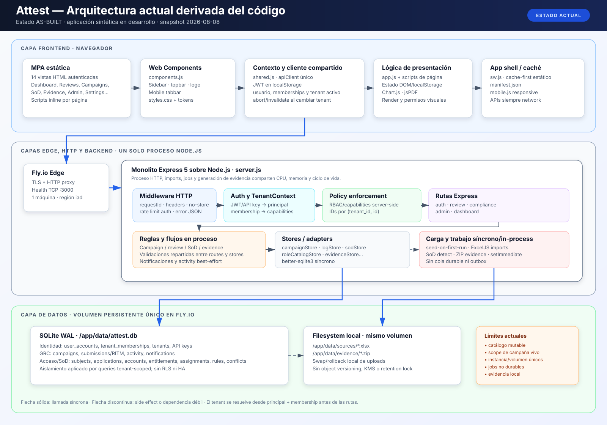
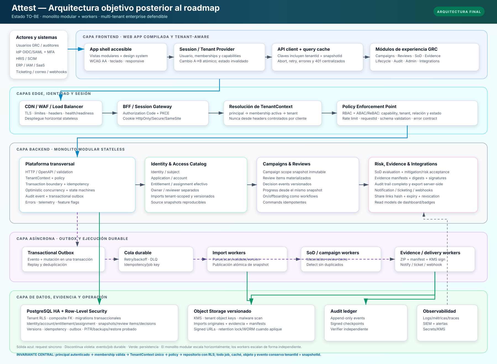

# CANONICAL SYSTEM SPECIFICATIONS: ATTEST — Access Certification & Role Governance
**Document Status:** CANONICAL / LIVING ARCHITECTURE SPECIFICATION
**Last Updated:** 2026-08-08

---

## 1. EXECUTIVE & LOGICAL ARCHITECTURE

### 1.1 System Purpose
Attest is a multi-tenant Governance, Risk, and Compliance (GRC) platform for enterprise access certification. It enables organizations to conduct periodic user access reviews (SOX, ITGC, ISO 27001, SOC 2, GDPR, NIST 800-53, COBIT 2019), detect Segregation of Duties (SoD) conflicts, manage employee onboarding/offboarding access lifecycles, and generate tamper-proof audit evidence packages for external auditors.

### 1.2 Architecture Views — Current State vs. Final State

The architecture is documented in two deliberately separate views. They MUST NOT be merged conceptually:

- **AS-BUILT / current state** is descriptive and is derived from the executable repository as of 2026-08-08. It is the reference for diagnosing current behavior.
- **TO-BE / final state** is normative and represents the architecture expected after completing the pending roadmap. A component appearing there does not mean it is implemented today.

Solid arrows represent synchronous calls, dashed arrows represent asynchronous or weakly coupled work, and green arrows in the target diagram represent durable persistence. Both views identify frontend, edge/session, backend, asynchronous processing, and data layers.

#### 1.2.1 Current Architecture — AS-BUILT



The current application is a static multi-page frontend served by a single Express process. The same process authenticates users, resolves the immutable request `TenantContext`, enforces capabilities, executes domain behavior, parses source files, runs SoD detection, generates evidence, and writes through synchronous SQLite stores. SQLite, uploaded workbooks, and evidence ZIP files share one attached Fly.io volume. There is no durable queue, transactional outbox, PostgreSQL RLS, or independent object storage in the current runtime.

#### 1.2.2 Final Architecture — TO-BE



The target remains a **modular monolith**, not a premature collection of microservices. The HTTP application becomes stateless and horizontally scalable; PostgreSQL with RLS becomes the transactional authority; imports, campaign scope, review items, decisions, SoD evaluations, and evidence are bound to immutable tenant snapshots. A transactional outbox and durable queue drive independently scalable import, campaign, SoD, evidence, and delivery workers. Versioned object storage retains source and evidence artifacts. Enterprise identity is integrated through a BFF/session gateway and the client no longer stores a bearer session token in JavaScript-accessible storage.

| Layer | Current AS-BUILT | Final TO-BE |
|---|---|---|
| Frontend | Static MPA, Web Components, page scripts, shared `apiClient`, JWT in `localStorage`, app-shell Service Worker | Compiled modular web app, accessible design system, centralized session/tenant provider, tenant+snapshot keyed cache, global auth/error handling |
| Edge and session | Fly TLS proxy; local JWT/API-key authentication in the Express process | CDN/WAF/load balancer plus BFF; OIDC/SAML Authorization Code + PKCE, MFA, HttpOnly session, SCIM provisioning |
| Authorization | Membership-derived `TenantContext` and server-side capabilities | Same invariant reinforced by RBAC + ABAC/ReBAC policy and resource-state checks |
| Backend | One Express process with routes, rules, imports, jobs, and stores | Stateless modular monolith with platform boundaries and explicit identity, campaign, review, SoD, evidence, lifecycle, and integration modules |
| Async work | `setImmediate`/in-process execution; no durable queue | Transactional outbox, durable queue, retry/backoff/DLQ, idempotent workers |
| Transactional data | SQLite WAL on one Fly volume; tenant-scoped queries | PostgreSQL HA with RLS, composite foreign keys, optimistic concurrency, idempotency, PITR and restore tests |
| Files/evidence | XLSX sources and ZIP evidence on the same local volume | Versioned object storage with tenant object keys, KMS, signed URLs, malware scanning, manifests and retention controls |
| Audit/operations | Activity rows and process logs; basic TCP health check | Append-only audit events/checkpoints, logs/metrics/traces, readiness, SIEM/alerts, secrets/KMS and tested recovery |

### 1.3 Tech Stack Inventory

| Layer | Technology | Version | Purpose |
|-------|-----------|---------|---------|
| Runtime | Node.js | 24.x LTS | JavaScript server runtime |
| Web Framework | Express | 5.2.x | HTTP routing, middleware pipeline |
| Database | better-sqlite3 | 13.x | Synchronous SQLite driver, WAL mode |
| Auth | jsonwebtoken | 9.x | JWT signing/verification (HS256, 24h expiry) |
| Password Hashing | bcrypt | 6.x | Admin password storage |
| File Parsing | xlsx | 0.18.x | Excel role/transaction import |
| PDF Generation | jsPDF + autotable | 4.x / 5.x | Audit evidence package export |
| ZIP Archiving | adm-zip | 0.6.x | Evidence package bundling |
| File Upload | multer | 2.x | Admin Excel upload middleware |
| Frontend Font | Inter | Google Fonts | System-wide typeface |
| Charts | Chart.js | 4.4.x | Dashboard certification progress bar charts |
| View Transitions | Native Browser API | Chrome 111+ | Crossfade page navigation |
| Confirm Dialogs | Attest.confirm / Attest.alert | shared.js | Styled modal replacing native confirm()/alert() |
| Button Spinner | Attest.btnLoading / .btn-spinner | shared.js | Loading state with animated spinner |
| Service Worker | Native Browser API | — | Offline caching, PWA manifest |

### 1.4 Build Pipeline

```
scripts/build.js
  ├── Reads public/*.html source files
  ├── Injects <script src="/components.js"> + <script src="/shared.js"> in <head>
  ├── Replaces hardcoded <aside class="sidebar"> → <attest-sidebar active="...">
  ├── Replaces hardcoded <header class="topbar"> → <attest-topbar breadcrumb="..." search-placeholder="...">
  ├── Injects <attest-mobile-tabbar active="..."> before </body>
  ├── Strips duplicate auth/fetch-override code (delegated to shared.js)
  └── Output: 14 production-ready static HTML pages
```

---

## 2. DATA MODELS & SCHEMA COMPLIANCE

### 2.1 `submissions` — Access Certification Decisions

| Column | Type | Constraints | Purpose |
|--------|------|-------------|---------|
| `log_entry_id` | TEXT | PRIMARY KEY | UUIDv4 unique submission identifier |
| `submission_id` | TEXT | NOT NULL | Sequential ID (000001–999999) |
| `timestamp` | TEXT | NOT NULL, INDEXED DESC | ISO 8601 submission timestamp |
| `approver` | TEXT | NOT NULL, INDEXED | Approver full name |
| `submitted_by_email` | TEXT | NOT NULL | Authenticated user email |
| `impersonated` | INTEGER | NOT NULL DEFAULT 0 | 1 if admin impersonated the approver |
| `role_name` | TEXT | NOT NULL, INDEXED | Business role identifier (e.g., "BE - FINANCE - ACCOUNTS PAYABLE") |
| `action` | TEXT | NOT NULL, INDEXED | Decision: Keep Business Role / Modify Business Role / Modify Technical Role / Reject Business Role |
| `ritm` | TEXT | NOT NULL DEFAULT '' | ServiceNow RITM ticket number |
| `ritm_status` | TEXT | NOT NULL DEFAULT 'Open' | RITM lifecycle: Open / Resolved / On Hold / Cancelled |
| `action_details` | TEXT | NOT NULL DEFAULT '' | JSON-encoded action metadata |
| `comments` | TEXT | NOT NULL DEFAULT '' | Approver free-text comments |
| `rejection_reason` | TEXT | NOT NULL DEFAULT '' | Mandatory reason if action = Reject |
| `row_index` | INTEGER | NOT NULL | Original row position in review table |
| `campaign_id` | TEXT | DEFAULT '' | Foreign key to campaigns.id (migration 002b) |
| `tenant_id` | TEXT | NOT NULL DEFAULT 'default' | Multi-tenant partition key (migration 004b) |

### 2.2 `activity` — Immutable Audit Log

| Column | Type | Constraints | Purpose |
|--------|------|-------------|---------|
| `activity_id` | TEXT | PRIMARY KEY | UUIDv4 unique event identifier |
| `timestamp` | TEXT | NOT NULL, INDEXED DESC | ISO 8601 event timestamp |
| `type` | TEXT | NOT NULL DEFAULT 'AUTH', INDEXED | Event category: AUTH / SUBMISSION / RITM / EVIDENCE / ADMIN |
| `action` | TEXT | NOT NULL | Human-readable action description |
| `email` | TEXT | NOT NULL, INDEXED | Actor email address |
| `detail` | TEXT | NOT NULL DEFAULT '' | Extended event metadata |
| `tenant_id` | TEXT | NOT NULL DEFAULT 'default' | Multi-tenant partition key (migration 004c) |

### 2.3 `admin_users` — Legacy Compatibility Table

This table is retained only for migration compatibility. Runtime authentication and authorization use `user_accounts` plus `tenant_memberships`; new code MUST NOT use `admin_users` as the source of truth.

| Column | Type | Constraints | Purpose |
|--------|------|-------------|---------|
| `email` | TEXT | PRIMARY KEY | Normalized email (lowercase, trimmed) |
| `protected` | INTEGER | NOT NULL DEFAULT 0 | 1 = cannot be deleted via UI |
| `created_at` | TEXT | NOT NULL DEFAULT (datetime('now')) | Account creation timestamp |
| `password_hash` | TEXT | DEFAULT '' | bcrypt hash (migration 004e) |
| `role` | TEXT | DEFAULT 'admin' | RBAC role: admin / approver / auditor (migration 004f) |
| `tenant_id` | TEXT | NOT NULL DEFAULT 'default' | Multi-tenant partition key (migration 004d) |

### 2.3a `user_accounts` — Authentication Identity

| Column | Type | Constraints | Purpose |
|--------|------|-------------|---------|
| `email` | TEXT | PRIMARY KEY | Global normalized login identity |
| `password_hash` | TEXT | NOT NULL DEFAULT '' | bcrypt password hash for the current local provider |
| `display_name` | TEXT | NOT NULL DEFAULT '' | Optional display name |
| `created_at` | TEXT | NOT NULL | Account creation timestamp |
| `updated_at` | TEXT | NOT NULL | Last account update |

### 2.3b `tenant_memberships` — Tenant Authorization Context

| Column | Type | Constraints | Purpose |
|--------|------|-------------|---------|
| `email` | TEXT | COMPOSITE PK | Account email |
| `tenant_id` | TEXT | COMPOSITE PK, INDEXED | Authorized tenant |
| `role` | TEXT | NOT NULL | Tenant-specific role: admin / approver / auditor |
| `approver_name` | TEXT | NOT NULL DEFAULT '' | Approver profile within this tenant |
| `status` | TEXT | NOT NULL DEFAULT 'active' | Membership lifecycle |
| `protected` | INTEGER | NOT NULL DEFAULT 0 | Membership cannot be deleted through normal UI |
| `created_at` | TEXT | NOT NULL | Membership creation timestamp |
| `updated_at` | TEXT | NOT NULL | Last membership update |

The same email may have different roles and approver profiles in different tenants.

### 2.3c Tenant Role Catalog

`tenant_role_assignments` partitions business roles, approvers, approver emails and source systems by `(tenant_id, role_name)`. `tenant_role_transactions` partitions permission rows by `(tenant_id, role_name, row_index)`. Review, campaign, dashboard and SoD routes read these tables instead of global in-memory role maps.

### 2.4 `campaigns` — Access Certification Campaigns

| Column | Type | Constraints | Purpose |
|--------|------|-------------|---------|
| `id` | TEXT | PRIMARY KEY | UUIDv4 unique campaign identifier |
| `tenant_id` | TEXT | NOT NULL DEFAULT 'default' | Multi-tenant partition key |
| `name` | TEXT | NOT NULL | Campaign display name |
| `description` | TEXT | NOT NULL DEFAULT '' | Campaign purpose / scope |
| `framework` | TEXT | NOT NULL DEFAULT 'SOX' | Compliance framework: SOX / ISO27001 / SOC2 / GDPR / NIST / COBIT |
| `period` | TEXT | NOT NULL | Certification period (e.g., "Q3 2026") |
| `status` | TEXT | NOT NULL DEFAULT 'draft', INDEXED | Lifecycle: draft → active → completed → archived |
| `deadline` | TEXT | NOT NULL DEFAULT '' | ISO 8601 certification deadline |
| `approvers` | TEXT | NOT NULL DEFAULT '[]' | JSON array of approver names |
| `created_by` | TEXT | NOT NULL | Creator email |
| `created_at` | TEXT | NOT NULL DEFAULT (datetime('now')), INDEXED DESC | Creation timestamp |
| `updated_at` | TEXT | NOT NULL DEFAULT (datetime('now')) | Last modification timestamp |

### 2.5 `sod_rules` — Segregation of Duties Rule Definitions

| Column | Type | Constraints | Purpose |
|--------|------|-------------|---------|
| `id` | TEXT | PRIMARY KEY | UUIDv4 rule identifier |
| `tenant_id` | TEXT | NOT NULL DEFAULT 'default' | Multi-tenant partition key |
| `name` | TEXT | NOT NULL | Rule display name |
| `role_a` | TEXT | NOT NULL | First conflicting role |
| `role_b` | TEXT | NOT NULL | Second conflicting role |
| `severity` | TEXT | NOT NULL DEFAULT 'high', INDEXED | Risk level: high / medium / low |
| `description` | TEXT | NOT NULL DEFAULT '' | Rule rationale |
| `framework` | TEXT | NOT NULL DEFAULT 'SOX' | Governing compliance framework |
| `created_by` | TEXT | NOT NULL | Creator email |
| `created_at` | TEXT | NOT NULL DEFAULT (datetime('now')) | Creation timestamp |

### 2.6 `sod_conflicts` — Detected SoD Violations

| Column | Type | Constraints | Purpose |
|--------|------|-------------|---------|
| `id` | TEXT | PRIMARY KEY | UUIDv4 conflict identifier |
| `tenant_id` | TEXT | NOT NULL DEFAULT 'default' | Multi-tenant partition key |
| `rule_id` | TEXT | NOT NULL | Foreign key to sod_rules.id |
| `user_email` | TEXT | NOT NULL | Affected user email |
| `approver_name` | TEXT | NOT NULL, INDEXED | Responsible approver |
| `role_a` | TEXT | NOT NULL | First conflicting role |
| `role_b` | TEXT | NOT NULL | Second conflicting role |
| `severity` | TEXT | NOT NULL DEFAULT 'high' | Inherited from rule |
| `detected_at` | TEXT | NOT NULL DEFAULT (datetime('now')) | Detection timestamp |
| `status` | TEXT | NOT NULL DEFAULT 'open', INDEXED | Lifecycle: open → mitigated → accepted |
| `mitigated_by` | TEXT | NOT NULL DEFAULT '' | Mitigator email |
| `mitigated_at` | TEXT | NOT NULL DEFAULT '' | Mitigation timestamp |
| `mitigation_notes` | TEXT | NOT NULL DEFAULT '' | Mitigation rationale |

### 2.7 `evidence_packages` — Auditor Evidence Archive

| Column | Type | Constraints | Purpose |
|--------|------|-------------|---------|
| `id` | TEXT | PRIMARY KEY | UUIDv4 package identifier |
| `tenant_id` | TEXT | NOT NULL DEFAULT 'default' | Multi-tenant partition key |
| `name` | TEXT | NOT NULL | Package display name |
| `campaign_id` | TEXT | NOT NULL DEFAULT '', INDEXED | Associated campaign |
| `description` | TEXT | NOT NULL DEFAULT '' | Auditor notes |
| `file_path` | TEXT | NOT NULL DEFAULT '' | Filesystem path to ZIP archive |
| `file_size` | INTEGER | NOT NULL DEFAULT 0 | Archive size in bytes |
| `generated_by` | TEXT | NOT NULL | Creator email |
| `generated_at` | TEXT | NOT NULL DEFAULT (datetime('now')) | Generation timestamp |
| `share_token` | TEXT | NOT NULL DEFAULT '' | 7-day expiring auditor access token |
| `share_expires_at` | TEXT | NOT NULL DEFAULT '' | Token expiration timestamp |

### 2.8 `tenants` — Multi-Tenant Organization Registry

| Column | Type | Constraints | Purpose |
|--------|------|-------------|---------|
| `id` | TEXT | PRIMARY KEY | Tenant unique identifier |
| `name` | TEXT | NOT NULL | Organization display name |
| `plan` | TEXT | NOT NULL DEFAULT 'starter' | Subscription tier: starter / professional / enterprise |
| `status` | TEXT | NOT NULL DEFAULT 'active' | Lifecycle: active / suspended |
| `settings` | TEXT | NOT NULL DEFAULT '{}' | JSON configuration blob |
| `created_at` | TEXT | NOT NULL DEFAULT (datetime('now')) | Creation timestamp |
| `updated_at` | TEXT | NOT NULL DEFAULT (datetime('now')) | Last modification timestamp |

### 2.9 `api_keys` — Programmatic Access Tokens

| Column | Type | Constraints | Purpose |
|--------|------|-------------|---------|
| `id` | TEXT | PRIMARY KEY | UUIDv4 key identifier |
| `tenant_id` | TEXT | NOT NULL DEFAULT 'default', INDEXED | Multi-tenant partition key |
| `name` | TEXT | NOT NULL | Human-readable key label |
| `key_prefix` | TEXT | NOT NULL | First 8 chars for UI identification |
| `key_hash` | TEXT | NOT NULL | SHA-256 hash of full key |
| `permissions` | TEXT | NOT NULL DEFAULT 'read-only' | Scope: read-only / read-write / admin |
| `created_by` | TEXT | NOT NULL | Creator email |
| `created_at` | TEXT | NOT NULL DEFAULT (datetime('now')) | Creation timestamp |
| `last_used_at` | TEXT | — | Last authentication timestamp |
| `revoked` | INTEGER | NOT NULL DEFAULT 0 | 1 = revoked |

### 2.10 `notifications` — In-App Alert Feed

| Column | Type | Constraints | Purpose |
|--------|------|-------------|---------|
| `id` | TEXT | PRIMARY KEY | UUIDv4 notification identifier |
| `tenant_id` | TEXT | NOT NULL DEFAULT 'default', INDEXED | Multi-tenant partition key |
| `type` | TEXT | NOT NULL | Category: submission / campaign / sod / evidence |
| `title` | TEXT | NOT NULL | Notification headline |
| `body` | TEXT | NOT NULL DEFAULT '' | Extended description |
| `link` | TEXT | NOT NULL DEFAULT '' | Target URL for click navigation |
| `icon` | TEXT | NOT NULL DEFAULT '🔔' | Emoji icon |
| `read` | INTEGER | NOT NULL DEFAULT 0, INDEXED | 0 = unread, 1 = read |
| `email` | TEXT | NOT NULL DEFAULT '' | Target user email |
| `created_at` | TEXT | NOT NULL DEFAULT (datetime('now')), INDEXED DESC | Creation timestamp |

### 2.11 `_migrations` — Schema Version Control

| Column | Type | Constraints | Purpose |
|--------|------|-------------|---------|
| `name` | TEXT | PRIMARY KEY | Migration identifier |
| `applied_at` | TEXT | NOT NULL DEFAULT (datetime('now')) | Application timestamp |

### 2.12 Database Pragmas

```sql
PRAGMA journal_mode = WAL;     -- Write-Ahead Logging for concurrent read performance
PRAGMA foreign_keys = ON;      -- Referential integrity enforcement
```

---

## 3. CORE LIFECYCLE & STATE TRANSITIONS

### 3.1 Navigation Lifecycle

```
User clicks sidebar link
  │
  ├─ [View Transitions API supported?]
  │   ├─ YES → document.startViewTransition()
  │   │         1. Browser captures screenshot of current page
  │   │         2. location.href = target.html
  │   │         3. New page loads: DOMContentLoaded → shared.js boot → page-specific JS
  │   │         4. Skeleton loaders render → API calls → data populates
  │   │         5. Browser crossfades old screenshot → new rendered page (200ms)
  │   │         CSS: ::view-transition-old(root) fade-out 200ms
  │   │              ::view-transition-new(root) fade-in 250ms
  │   │              .sidebar { animation: none } (static, no flicker)
  │   │              .main { view-transition-name: main-content }
  │   │
  │   └─ NO  → Direct location.href (graceful degradation)
  │
  ├─ Service Worker (sw.js) intercepts request
  │   └─ Serves from cache if available (offline-first)
  │
  └─ New page renders independently with its own boot() sequence
```

### 3.2 Campaign Lifecycle

```
[draft] ──► [active] ──► [completed] ──► [archived]
   │           │              │                │
   │           │              │                └── Read-only, hidden from active views
   │           │              └── All approvers certified or deadline passed
   │           └── Admin clicks "Activate", notifications sent to approvers
   └── Initial creation state, approvers configurable

Delete: Available only for [draft] and [archived] states
        Not available for [active] (must complete first)
```

### 3.3 Offboarding & Access Revocation Workflow

```
HR Termination Event
  │
  ▼
[Urgent] ─────────────────────────────────────────────┐
  │  Class: row-urgent                                 │
  │  Light: bg=var(--danger-light) + border-left:3px   │
  │  Dark:  bg=#1A0A0A + border-left:#F87171           │
  │  Badge: badge-danger "Urgent — Nd left"            │
  │  Action: "Revoke All" button (btn-danger)          │
  │  Condition: ≤14 days until last day                │
  │                                                    │
  ▼                                                    │
[Pending] ────────────────────────────────────────────┤
  │  Class: row-warning                                │
  │  Light: bg=var(--warning-light) + border-left:3px  │
  │  Dark:  bg=#1A1005 + border-left:#FBBF24           │
  │  Badge: badge-warning "Pending — Nd left"          │
  │  Action: "Review" button (btn-secondary)           │
  │  Condition: >14 days until last day                │
  │                                                    │
  ▼                                                    │
[Revoked] ────────────────────────────────────────────┘
   │  Background: default row (no highlight class)
   │  Badge: badge-success "Revoked — MMM D"
   │  Action: "View Log" button (btn-ghost)
   │  Condition: All roles revoked, access terminated
   │
   └── Audit trail entry generated with:
         - Employee name, department, last day
         - Roles revoked count, privileged access count
         - Revocation timestamp, executor email
```

### 3.4 Evidence Traceability Matrix

| Package Component | Source Table | Format | Regulatory Mapping |
|-------------------|-------------|--------|-------------------|
| `summary.json` | campaigns | JSON | Campaign metadata (framework, period, approvers) |
| `submissions.csv` | submissions | CSV | All certification decisions with RITM cross-reference |
| `activity.csv` | activity | CSV | Full immutable audit trail (who, when, what) |
| `manifest.txt` | Generated | TXT | Package checksums, generator identity, timestamp |
| Archive format | ZIP (CSV + TXT) | .zip | Self-contained, no external dependencies |

**Share Token Model:** `share_token` is a UUIDv4 valid for 7 days. Auditor accesses via `GET /api/evidence/:id/download?token=:share_token`. No authentication required when valid token is present.

---

## 4. UI/UX SYSTEM TOKENS & ACCESSIBILITY LAWS

### 4.1 Chromatic Theme System

```
┌─────────────────────────────────────────────────────────────┐
│ LIGHT THEME                    │ DARK THEME                  │
├─────────────────────────────────────────────────────────────┤
│ --bg-root: #F8FAFC (slate-50)  │ --bg-root: #0F172A (slate-900) │
│ --bg-surface: #FFFFFF          │ --bg-surface: #1E293B (slate-800) │
│ --bg-sidebar: #0B1121          │ --bg-sidebar: #020617      │
│ --text-primary: #0F172A        │ --text-primary: #F1F5F9    │
│ --text-secondary: #475569      │ --text-secondary: #94A3B8  │
│ --text-tertiary: #94A3B8       │ --text-tertiary: #64748B   │
│ --accent: #0891B2 (cyan-600)   │ (unchanged)                 │
│ --success: #059669 (emerald)   │ (unchanged)                 │
│ --warning: #D97706 (amber)     │ (unchanged)                 │
│ --danger: #DC2626 (red-600)    │ (unchanged)                 │
└─────────────────────────────────────────────────────────────┘
```

**WCAG AAA Compliance Rule:** All semantic badges and alert rows maintain minimum 7:1 contrast ratio (AAA) for body text. Hardcoded light backgrounds (`#FEF2F2`, `#FFFBEB`) are prohibited — all row highlights use CSS classes with dark mode variants.

**Alert Row Classes (Dark Mode compliant):**

| Class | Light Background | Dark Background | Border Accent | Use Case |
|-------|-----------------|-----------------|---------------|----------|
| `.row-urgent` | `var(--danger-light)` | `#1A0A0A` | `#F87171` red | Offboarding ≤14d, critical SoD |
| `.row-warning` | `var(--warning-light)` | `#1A1005` | `#FBBF24` gold | Offboarding >14d, high SoD |
| `.row-critical` | `var(--danger-light)` | `#1A0A0A` | `#EF4444` red | SoD critical severity |
| `.rejected-row` | `var(--danger-light)` | `#1A0A0A` | — | Review table rejected |

**Badge Neutral (Dark Mode):** `.badge-neutral { background:#1E293B }` in dark mode for legibility.

**Auth Error (Dark Mode):** `.auth-error { background:#2D0F0F; color:#FCA5A5; border-color:#7F1D1D }` in dark mode.

**Framework Badge Chromatic Encoding:**

| Framework | Light Background | Light Text | Dark Background | Dark Text |
|-----------|-----------------|------------|-----------------|-----------|
| SOX / ITGC | `#EFF6FF` | `#1D4ED8` | `#0F1F3D` | `#60A5FA` |
| SOC 2 | `#F5F3FF` | `#6D28D9` | `#1F103D` | `#A78BFA` |
| ISO 27001 | `#ECFEFF` | `#0E7490` | `#0F2D3D` | `#22D3EE` |
| GDPR | `#FEF2F2` | `#B91C1C` | `#2D0F0F` | `#F87171` |
| NIST 800-53 | `#FFFBEB` | `#B45309` | `#2D1F0A` | `#FBBF24` |
| COBIT 2019 | `#F0FDF4` | `#15803D` | `#0A1F0F` | `#4ADE80` |

### 4.2 Component Geometry

| Property | Value | Rationale |
|----------|-------|-----------|
| Container border-radius | 4px (`--radius-sm`), 6px (`--radius`), 8px (`--radius-lg`) | Geometric precision; no consumer-SaaS pill shapes |
| Card shadow | `0 1px 3px rgba(0,0,0,.03)` | Subtle elevation; hover elevates to `0 2px 8px rgba(0,0,0,.06)` |
| Modal backdrop | `rgba(15,23,42,.5)` + `backdrop-filter: blur(4px)` | Glassmorphism overlay |
| Sidebar width | 248px (`--sidebar-w`) | Fixed; no responsive collapse (mobile uses bottom tabbar) |
| Topbar height | 56px (`--topbar-h`) | Fixed |
| Content padding | 24px | Consistent across all pages |

### 4.3 Scrollbar System

```
Container               Width    Track       Thumb                      Hover
────────────────────────────────────────────────────────────────────────────
.sidebar                4px      transparent rgba(255,255,255,.15)    rgba(255,255,255,.25)
.sidebar-nav            none     —           —                          —
.content                5px      transparent var(--border)             var(--text-tertiary)
.modal                  5px      transparent var(--border)             var(--text-tertiary)
.table-scroll (horizontal) 5px  transparent var(--border)             var(--text-tertiary)
.notif-list             native   —           —                          —
```

All scrollbar implementations use the standard `scrollbar-width: thin` (Firefox) and `::-webkit-scrollbar` pseudo-elements (Chrome/Edge/Safari). No JavaScript-based custom scrollbar libraries are permitted.

### 4.4 Typography Matrix

| Usage | Font | Size | Weight | Line Height | Features |
|-------|------|------|--------|-------------|----------|
| Page heading (h1) | Inter | 14px | 700 | 1.5 | `letter-spacing: -.2px` |
| Card heading (h2) | Inter | 14px | 700 | 1.5 | `letter-spacing: -.2px` |
| Stat value | Inter | 28px | 800 | 1.2 | `letter-spacing: -.8px` |
| Table header | Inter | 11px | 600 | 1.5 | `text-transform: uppercase; letter-spacing: .4px` |
| Table body | Inter | 12.5px | 400 | 1.5 | — |
| Numeric data (`.num`) | Inter | 12.5px | 400 | 1.5 | `text-align: right; font-variant-numeric: tabular-nums` |
| ID cells (`.id-cell`) | SF Mono / Cascadia Code / Consolas | 11px | 400 | 1.5 | `letter-spacing: .3px` |
| Badge text | Inter | 11px | 600 | 1.5 | `letter-spacing: .1px` |
| Sidebar item | Inter | 13px | 500 | 1.5 | — |
| Sidebar section label | Inter | 10px | 600 | 1.5 | `text-transform: uppercase; letter-spacing: .8px` |
| Form label | Inter | 12px | 600 | 1.5 | — |
| Form input | Inter | 13px | 400 | 1.5 | — |

---

## 5. SECURITY & COMPLIANCE PARADIGMS

### 5.1 Authentication

**Token Structure:**
```
Header: { "alg": "HS256", "typ": "JWT" }
Payload: {
  "email": "admin.one@attest.local",
  "tenant_id": "default",
  "iat": 1691452800,
  "exp": 1691539200
}
```

**Storage:** `localStorage.getItem('attest_token')` on the client. Sent via `Authorization: Bearer <token>` header on every `fetch()` call. The token interceptor in `shared.js` wraps the native `window.fetch` to auto-inject the header.

**Expiration:** 24 hours from issuance. No refresh token mechanism. On expiry, the client is redirected to `/login.html`.

**Development Mode:** When `NODE_ENV !== 'production'`, the `DEV_AUTH_EMAIL` environment variable auto-authenticates the session, bypassing the login form. A random JWT secret is generated on server start (persists only for the process lifetime).

### 5.2 Multi-Tenancy

**Isolation Mechanism:**

```
Request
  │
  ├─ Authenticate JWT or API key
  ├─ Read tenant_id from the verified credential
  ├─ Validate active (email, tenant_id) membership for users
  └─ Build immutable Principal/TenantContext
      │
      ▼
  req.tenantId attached to all service/store operations
      │
      ▼
  IDs and queries are scoped by (tenant_id, id)
```

`X-Tenant-ID` is never an authorization source for browser/user traffic. Tenant switching calls `/api/auth/switch-tenant`; the server verifies membership and issues a new JWT. A client-supplied header cannot override the authenticated context.

Tenant-scoped tables: `tenant_memberships`, `tenant_role_assignments`, `tenant_role_transactions`, `submissions`, `activity`, `campaigns`, `sod_rules`, `sod_conflicts`, `evidence_packages`, `api_keys`, and `notifications`. The `tenants` and `user_accounts` registries are global but are never returned without membership filtering.

### 5.3 Audit Logging

**Event Recording Pattern:**
```javascript
function recordActivity(event, tenantId) {
  const e = { ...event, tenantId: tenantId || 'default' };
  Promise.resolve()
    .then(() => activityStore.record(e))
    .catch(err => console.error('[activity] record failed:', err));
}
```

Every page access, API call, submission, RITM update, campaign status change, evidence generation, and authentication event is recorded as an immutable row in the `activity` table. The log is fire-and-forget (non-blocking) to avoid impacting request latency. Failed log writes are printed to stderr but never returned to the client.

**Audit Trail UI:** The `/audit-trail.html` page provides a filterable, sortable, exportable view of all `submissions` joined with `activity`. Export formats: XLSX, CSV, PDF.

### 5.4 Authorization Model

| Role | Rank | Permissions |
|------|------|-------------|
| `admin` | 3 | Administrative access inside the active tenant; no implicit access to other tenants |
| `approver` | 2 | Review own roles, view campaigns, view SoD conflicts, view evidence |
| `auditor` | 1 | Read-only: dashboard, audit trail, evidence locker (no modifications) |

Role-based UI visibility is enforced client-side via `data-min-role` attributes on sidebar sections. It is only presentation logic. Server-side authorization derives `req.auth.role` and `req.auth.isAdmin` from the active membership and remains authoritative for every mutation.

### 5.5 Protected Admin Accounts

The following synthetic memberships are flagged as `protected = 1` and cannot be deleted via the UI:

```
superadmin.one@attest.local
superadmin.two@attest.local
```

### 5.6 Source Import Compatibility Contract

The Excel parser still builds in-memory arrays while importing a workbook, and those collections are mutated in place for compatibility. They are no longer an authorization or route-data contract. After parsing, the importer replaces only the active tenant's rows in `tenant_role_assignments` and `tenant_role_transactions`; runtime routes read the tenant-scoped catalog.

**Approved clearing pattern:**
```javascript
// Arrays: clear in-place, preserve reference
uniqueRoleNames.length = 0;
uniqueRoleNames.push(...newItems);

// Objects: delete all keys, repopulate
for (var k in roleToApprover) delete roleToApprover[k];
Object.assign(roleToApprover, newData);
```

**Prohibited compatibility pattern:**
```javascript
// Do not reassign during parsing — compatibility consumers retain the old reference
uniqueRoleNames = [];
roleToApprover = {};
```

---

*End of Canonical Specification. This document supersedes all design notes, mockups, and planning artifacts. Update sections in-place as the system evolves; never append changelogs.*
