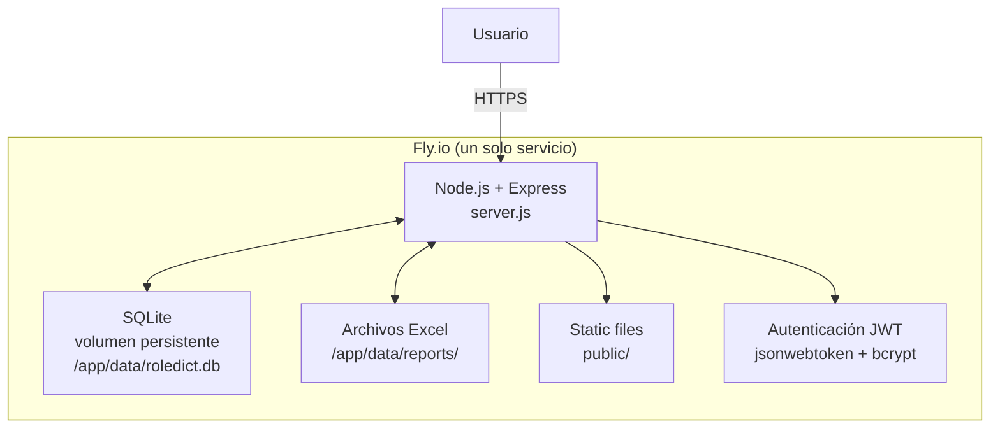
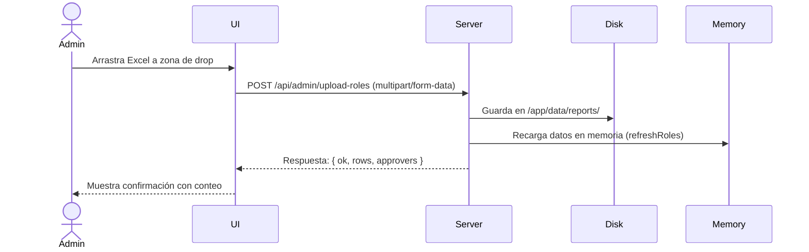
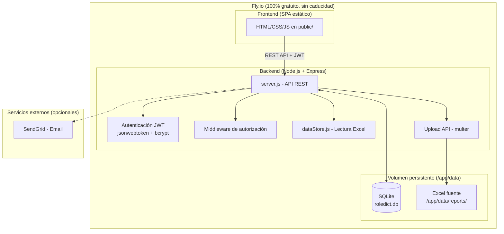
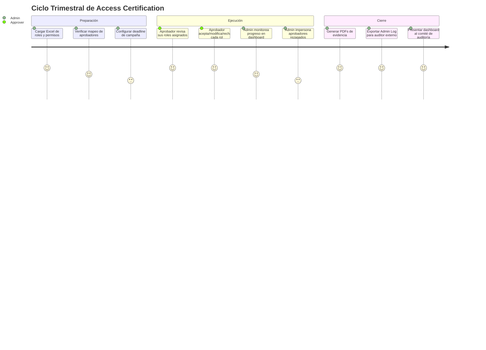
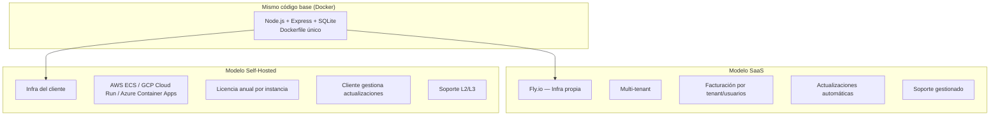
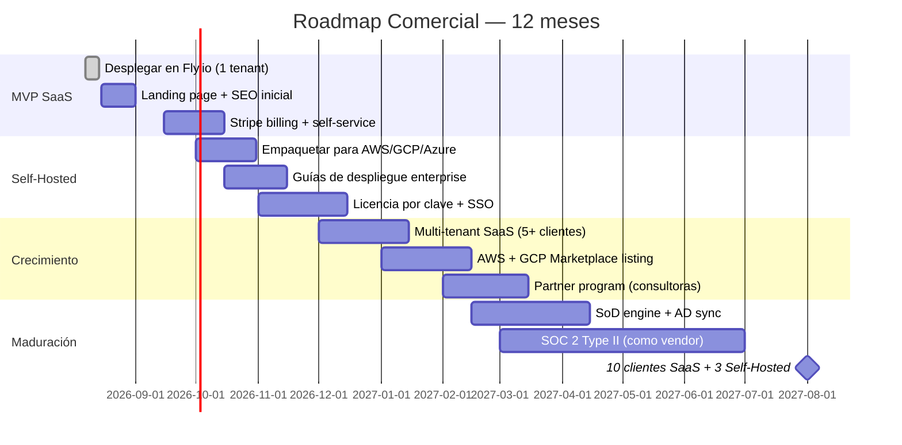

# Plan de Mejora — RoleDictionaryApp (ARCHIVADO)

> ⚠️ **Este documento fue reemplazado por [`MASTER-PLAN.md`](MASTER-PLAN.md)** el 2026-08-07.
> Se conserva como referencia histórica de las Fases 1-4 (limpieza, migración GCP, deploy Fly.io, rediseño visual inicial).
> Para el plan vigente que cubre hasta el lanzamiento completo alineado al mockup, ver el Master Plan.

> **Fecha:** 2026-08-07
> **Autor:** Análisis automático del repositorio
> **Versión:** 3.1 — + Mockups visuales (App + Landing) como norte de producto

---

## 🎨 Assets Visuales del Plan

Este plan está acompañado de dos mockups HTML interactivos que representan la visión completa del producto:

| Asset | Archivo | Propósito |
|---|---|---|
| **Mockup de la App** | [`docs/mockup-futuro.html`](mockup-futuro.html) | Simulación interactiva de la aplicación completa post-mejoras. **13 páginas** funcionales: Dashboard, Campañas, My Reviews, Onboarding, Offboarding, Audit Trail, SoD Conflicts, Evidence Locker, Data Sources, Users & Roles, Tenants, Settings, API Keys. Incluye modo oscuro, selector de idioma ES/EN, y plantillas de campaña. **Este mockup es el norte de UI/UX del proyecto.** |
| **Landing Page** | [`docs/landing-page.html`](landing-page.html) | Página comercial de ventas destacando los 7 casos de uso, planes de precios, modelos de despliegue (SaaS + Self-Hosted), testimonios, y CTAs de conversión. |

> **Principio rector:** Todas las decisiones de desarrollo, arquitectura y diseño deben acercar la app real al mockup futuro. El mockup no es un sueño — es el plano.

---

## Tabla de Contenido

1. [Resumen del Proyecto Actual](#1-resumen-del-proyecto-actual)
2. [Anonimización de Datos Reales](#2-anonimización-de-datos-reales)
3. [Migración de GCP a Fly.io + SQLite](#3-migración-de-gcp-a-flyio--sqlite-100-gratuito-sin-caducidad)
4. [Reemplazo del Logo Corporativo](#4-reemplazo-del-logo-corporativo)
5. [Nuevos Casos de Uso y Mejora de Capacidades](#5-nuevos-casos-de-uso-y-mejora-de-capacidades)
6. [Propuesta de Valor y Posicionamiento](#6-propuesta-de-valor-y-posicionamiento)
7. [Estrategia Comercial B2B — SaaS + Self-Hosted](#7-estrategia-comercial-b2b--saas--self-hosted)
8. [Plan de Ejecución por Fases](#8-plan-de-ejecución-por-fases)
9. [Resumen de Archivos a Modificar](#9-resumen-de-archivos-a-modificar)

---

## 1. Resumen del Proyecto Actual

**RoleDictionaryApp** es una aplicación Node.js/Express que permite la revisión de un "Diccionario de Roles" empresarial. Los aprobadores revisan roles de negocio, consultan permisos (transacciones) asociados, y emiten acciones: **Keep Business Role**, **Modify Business Role**, **Modify Technical Role** o **Reject Business Role**.

La app fue construida originalmente para la empresa **Amrize** y desplegada en **Google Cloud Platform**. El objetivo de este plan es transformarla en **Attest**, una plataforma SaaS profesional de Access Certification & Role Governance — ver [`mockup-futuro.html`](mockup-futuro.html) para la visión completa del producto final.

La versión original utilizaba:

- **Cloud Run** como runtime de contenedor
- **Firestore** como base de datos para submissions, activity y adminUsers
- **Cloud Storage** como repositorio de archivos Excel fuente
- **Cloud IAP** (Identity-Aware Proxy) como capa de autenticación corporativa

### Estructura del repositorio

```text
server.js                 Servidor Express y API routes
logStore.js               Persistencia de submissions (file o Firestore)
activityStore.js          Persistencia de activity log (file o Firestore)
adminUserStore.js         Persistencia de admin users (file o Firestore)
dataStore.js              Lectura de Excel fuente (local o GCS)
fileSafety.js             Utilidades de sistema de archivos seguro
public/                   Frontend estático (HTML, JS, CSS, assets)
Reports/                  Archivos Excel fuente
data/                     Datos de persistencia local (JSON, samples)
deploy/                   Scripts de despliegue GCP y documentación
docs/                     Documentación de arquitectura y negocio
Dockerfile                Imagen para Cloud Run
package.json              Dependencias Node.js
test-e2e.js               Pruebas end-to-end con Playwright
```

### Funcionalidades principales

| Funcionalidad | Descripción |
|---|---|
| Revisión de roles | Tabla con roles de negocio asignados al aprobador |
| Consulta de permisos | Popup con transacciones/t-codes asociados a cada rol |
| Workflow de acciones | Keep, Modify Business Role, Modify Technical Role, Reject |
| Generación de PDF | PDFs separados para Keep y Remove/Modify con anexo de transacciones |
| Admin Log | Bitácora de todas las submissions con filtros, export CSV/PDF, edición RITM |
| Activity Log | Registro de accesos, autorizaciones, submissions y cambios RITM |
| Admin Users | Gestión de emails autorizados como administradores |
| Impersonación | Admin puede impersonar a un aprobador para revisar en su nombre |
| Refresh de datos | Recarga periódica o manual de archivos Excel fuente |

---

## 2. Anonimización de Datos Reales

Se identificaron **más de 37 ocurrencias** de datos personales reales y referencias corporativas que deben ser reemplazados por valores sintéticos.

### 2.1 Correos electrónicos → Sintéticos

| Archivo | Línea(s) | Correo Real | → Correo Sintético |
|---|---|---|---|
| `adminUserStore.js` | 10 | `andres.escarraga@amrize.com` | `admin.one@roledict.local` |
| `adminUserStore.js` | 11 | `lisa.mueller@amrize.com` | `admin.two@roledict.local` |
| `adminUserStore.js` | 12 | `steph.greenland@amrize.com` | `admin.three@roledict.local` |
| `adminUserStore.js` | 13 | `benjamin.otis@amrize.com` | `admin.four@roledict.local` |
| `adminUserStore.js` | 14 | `natalia.montoyavasquez@amrize.com` | `admin.five@roledict.local` |
| `adminUserStore.js` | 15 | `juan.jaramillo@amrize.com` | `admin.six@roledict.local` |
| `adminUserStore.js` | 17 | `andres.patino@amrize.com` | `superadmin.one@roledict.local` |
| `adminUserStore.js` | 18 | `rpa-na@amrize.com` | `superadmin.two@roledict.local` |
| `package.json` | 9 | `andres.escarraga@amrize.com` | `admin.one@roledict.local` |
| `package.json` | 10 | `ammy.miller@amrize.com` | `approver.one@roledict.local` |
| `package.json` | 11 | `not.authorized@amrize.com` | `denied.user@roledict.local` |
| `server.js` | 34, 361 | `Benjamin.Otis@amrize.com` | `support@roledict.local` |
| `public/app.js` | 70 | `Benjamin.Otis@amrize.com` | `support@roledict.local` |
| `deploy/seed-firestore-admins.ps1` | 15-22 | Todos los emails | Mismos sintéticos de arriba |
| `deploy/check-and-seed.ps1` | 97 | `rpa-na@amrize.com` | `superadmin.two@roledict.local` |

### 2.2 Nombres de personas en datos

| Archivo | Dato Real | → Dato Sintético |
|---|---|---|
| `data/submissions.json` | `Ammy Miller` | `Morgan Taylor` |
| `data/submissions.json` | `Amy WAY` | `Jamie Rivera` |
| `data/activity.json` | `andres.escarraga@amrize.com` (múltiples entradas) | Limpiar archivo |
| `test-e2e.js` | `Agustin BAEZ` | `Casey Morrison` |

### 2.3 Referencias a la empresa "Amrize"

| Archivo | Cambio requerido |
|---|---|
| `public/index.html` | `alt="Amrize"` → `alt="RoleDict"`, título y textos |
| `public/admin.html` | `alt="Amrize"` → `alt="RoleDict"` |
| `public/admin-users.html` | `alt="Amrize"` → `alt="RoleDict"`, `placeholder="name@amrize.com"` → `placeholder="admin@example.com"` |
| `public/activity.html` | `alt="Amrize"` → `alt="RoleDict"` |
| `server.js` | Mensaje `UNAUTHORIZED_MESSAGE` — eliminar referencia a Benjamin Otis/Amrize |
| `README.md` | Actualizar nombres y correos |
| `deploy/README-DEPLOY.md` | Limpiar referencias corporativas |
| `deploy/README-DEPLOY-ES.md` | Limpiar referencias corporativas |
| `deploy/README-REDEPLOY-EXISTING-GCP-ES.md` | Limpiar o archivar |
| `docs/architecture/Analisis-Desviaciones-Arquitectura-IT.md` | Limpiar referencias a Amrize |

### 2.4 Archivos de datos a limpiar

| Archivo | Acción |
|---|---|
| `data/submissions.json` | Reemplazar contenido con `[]` |
| `data/activity.json` | Reemplazar contenido con `[]` |
| `data/admin-users.json` | Reemplazar con lista de correos sintéticos |
| `data/samples/*.pdf` | **Eliminar** (contienen nombres reales: Agustin BAEZ) |
| `Reports/Roles Approvers.xlsx` | Reemplazar con datos de ejemplo sintéticos |
| `Reports/Transactions.xlsx` | Reemplazar con datos de ejemplo sintéticos |
| `deploy/last-logs.json` | **Eliminar** (contiene `camilo.vargas@amrize.com`) |

---

## 3. Migración de GCP a Fly.io + SQLite (100% gratuito sin caducidad)

### 3.1 Decisión final: Fly.io + SQLite

Tras evaluar múltiples proveedores con el requisito de **gratis sin límite de tiempo**, la solución elegida es:

| Capa | Solución | Límite | ¿Caduca? |
|---|---|---|---|
| **Web hosting** | **Fly.io** (3 VMs × 256MB compartidas) | Free allowance mensual perpetuo | ❌ No |
| **Base de datos** | **SQLite** (`better-sqlite3`) en volumen persistente de Fly.io | 3GB gratis | ❌ No |
| **Archivos Excel** | Sistema de archivos local en volumen persistente | 3GB | ❌ No |

**¿Por qué no Render.com + Neon?** Render PostgreSQL caduca a los 90 días. Neon tiene solo 100h/mes de compute. Fly.io + SQLite es la única combinación 100% gratuita sin fecha de caducidad.

**Ventajas de SQLite sobre PostgreSQL para este proyecto:**
- Cero latencia de red (archivo local en el mismo servidor)
- Sin conexiones TCP, pools, ni configuración de red
- `better-sqlite3` es síncrono: código más simple, sin async/await para DB
- Más que suficiente para una app de bajo tráfico como esta
- El archivo `.db` vive en el volumen persistente de Fly.io (`/app/data`)

### 3.2 Arquitectura objetivo



### 3.3 Configuración de Fly.io

```toml
# fly.toml (nuevo archivo a crear)
app = "roledict"
primary_region = "iad"

[build]
  dockerfile = "Dockerfile"

[mounts]
  source = "roledict_data"
  destination = "/app/data"

[env]
  PORT = "3000"
  DATA_STORE = "local"
  REPORTS_DIR = "/app/data/reports"
  DB_PATH = "/app/data/roledict.db"
  JWT_SECRET = ""  # Se configura con fly secrets set

[[services]]
  internal_port = 3000
  protocol = "tcp"

  [[services.ports]]
    handlers = ["http"]
    port = 80

  [[services.ports]]
    handlers = ["tls", "http"]
    port = 443
```

### 3.4 Dependencias GCP a eliminar/reemplazar

| Dependencia GCP | Uso Actual | → Alternativa Gratuita |
|---|---|---|
| `@google-cloud/firestore` | Base de datos para submissions, activity, adminUsers | **better-sqlite3** (SQLite síncrono) |
| `@google-cloud/storage` | Lectura de Excel fuente desde bucket GCS | **Sistema de archivos local** (`DATA_STORE=local` + volumen persistente Fly.io) |
| `google-auth-library` | Verificación JWT de Google IAP | **jsonwebtoken + bcrypt** (auth propia con JWT) |
| `gcloud` CLI / deploy scripts | Despliegue a Cloud Run | **flyctl** CLI (`fly deploy`) |

### 3.5 Reemplazo de archivos Excel por versión sintética ligera

#### Análisis de columnas realmente usadas por la app

El parseo en `server.js` solo consume columnas específicas. El resto se ignora.

**Roles Approvers.xlsx — Hoja "Complete":**

| Columna | Índice | Usada por el código | Propósito |
|---|---|---|---|
| A | `row[0]` | ✅ Sí | `roleName` — identificador único del rol |
| B | `row[1]` | ❌ No | Ignorada |
| C | `row[2]` | ❌ No | Ignorada |
| D | `row[3]` | ✅ Sí | `fullName` — nombre del aprobador asignado |
| E+ | `row[4+]` | ❌ No | Ignoradas |

**Roles Approvers.xlsx — Hoja "Emails":**

| Columna | Header contiene | Usada | Propósito |
|---|---|---|---|
| Full Name | `"full"` + `"name"` | ✅ Sí | Nombre completo del aprobador |
| Email | `"email"` | ✅ Sí | Correo electrónico del aprobador |

**Transactions.xlsx — Hoja única:**

| Columna | Índice | Rename aplicado | Usada |
|---|---|---|---|
| A | `row[0]` | `Role Name` → `Business Role` | ✅ Sí — clave para agrupar por rol |
| B | `row[1]` | `Associated Role` → `Technical Role` | ✅ Sí — se muestra en la tabla de permisos |
| C | `row[2]` | `Associated Role Description` → `Technical Role Description` | ✅ Sí — se muestra en la tabla de permisos |
| D+ | `row[3+]` | Sin rename | ✅ Sí — se muestran tal cual en la tabla de permisos |

#### Nuevo Excel sintético — Roles Approvers.xlsx

- **Hoja "Complete"**: Solo 4 columnas (A-D) con ~15 roles sintéticos y 5 aprobadores ficticios
- **Hoja "Emails"**: 2 columnas (Full Name, Email) mapeando los 5 aprobadores a emails sintéticos
- **Peso estimado**: ~6 KB (vs ~50 KB del original)

#### Nuevo Excel sintético — Transactions.xlsx

- **Hoja única**: Solo 4 columnas (Role Name, Associated Role, Associated Role Description, Permission Name) con ~100 filas (vs ~40,000 del original)
- **Peso estimado**: ~15 KB (vs ~22 MB del original — **reducción del 99.93%**)
- Se eliminan cientos de columnas no usadas que el original incluía

### 3.6 Nueva funcionalidad: Carga de Excel desde la UI (Drag & Drop)

En lugar de depender de archivos precargados en el servidor, se implementa una sección en la página de Admin para que los administradores puedan **subir nuevos archivos Excel directamente desde el navegador**, permitiendo el mantenimiento autónomo del diccionario de roles.

#### Flujo de usuario



#### Endpoints nuevos

| Método | Ruta | Descripción |
|---|---|---|
| `POST` | `/api/admin/upload-roles` | Recibe `Roles Approvers.xlsx`, valida estructura, guarda y recarga |
| `POST` | `/api/admin/upload-transactions` | Recibe `Transactions.xlsx`, valida estructura, guarda y recarga |
| `GET` | `/api/admin/data-status` | Devuelve metadata de los archivos actuales (nombre, filas, última carga) |

#### Validaciones del upload

- Solo archivos `.xlsx` (verificado por extensión y magic bytes)
- Tamaño máximo: 5 MB por archivo
- Solo administradores pueden subir (`requireAdmin`)
- El archivo `Roles Approvers.xlsx` debe tener al menos la columna A (Role Name) y D (Full Name)
- El archivo `Transactions.xlsx` debe tener al menos la columna A (Role Name)
- Si la validación falla, se devuelve error descriptivo sin modificar los archivos existentes

#### UI: Sección de upload en Admin Log

Se agrega un panel colapsable en `admin.html` con:
- **Zona de drop** para arrastrar archivos Excel
- **Botón de selección** como alternativa al drag & drop
- **Indicador de estado** mostrando el último archivo cargado, fecha y conteo de filas
- **Validación visual**: borde verde si es válido, rojo con mensaje si hay error

#### Dependencia nueva

| Paquete | Propósito |
|---|---|
| `multer` | Middleware para procesar `multipart/form-data` (upload de archivos) |

### 3.7 Cambios específicos en el código

#### A. Eliminar backends Firestore y GCS

En `logStore.js`, `activityStore.js` y `adminUserStore.js`:
- Eliminar las clases `FirestoreLogStore`, `FirestoreActivityStore` y `FirestoreAdminUserStore`
- Implementar `SqliteLogStore`, `SqliteActivityStore`, `SqliteAdminUserStore` con `better-sqlite3`
- El backend de archivos JSON se elimina también — todo va a SQLite

En `dataStore.js`:
- Eliminar la clase `GcsDataStore`
- Mantener `LocalDataStore`, apuntando a `REPORTS_DIR` (por defecto `/app/data/reports` en Fly.io)

#### B. Simplificar autenticación

En `server.js`:
- Eliminar `verifyIapJwt()` y toda la lógica de IAP
- Eliminar las constantes `IAP_ISSUERS`, `iapClient`, `iapPublicKeysPromise`
- Implementar autenticación con JWT + bcrypt:
  - `POST /api/auth/login` — recibe `{ email, password }`, devuelve `{ token }`
  - `POST /api/auth/setup` — solo disponible si no hay admins creados (primer uso)
  - Middleware `authMiddleware` que verifica `Authorization: Bearer <token>`
- Eliminar `UNAUTHORIZED_MESSAGE` corporativo
- Eliminar `schedulePeriodicRefresh()` (innecesario con upload manual)
- Agregar endpoints de upload de Excel

#### C. Actualizar dependencias

En `package.json`:
- **Eliminar:** `@google-cloud/firestore`, `@google-cloud/storage`, `google-auth-library`
- **Agregar:** `better-sqlite3`, `jsonwebtoken`, `bcrypt`, `multer`

#### D. Adaptar Dockerfile para Fly.io

- Imagen base `node:20-alpine`
- Agregar dependencias de compilación para `better-sqlite3` (requiere `python3`, `make`, `g++`)
- `USER node` y volumen en `/app/data`
- `PORT=3000` por defecto
- Health check simplificado
- Sin referencias a GCP

---

## 4. Reemplazo del Logo Corporativo

### Archivos actuales con el logo de Amrize

| Archivo | Descripción |
|---|---|
| `public/assets/amrize-logo.svg` | Logo azul (#011E6A) con texto "Amrize" |
| `public/assets/amrize-logo-white.svg` | Logo blanco con texto "Amrize" |

### Referencias en el código

| Archivo | Línea | Uso |
|---|---|---|
| `public/index.html` | 100 | `` |
| `public/admin.html` | 20 | `` |
| `public/admin-users.html` | 16 | `` |
| `public/activity.html` | 16 | `` |
| `public/admin.js` | 375 | `const logoUrl = '/assets/amrize-logo-white.svg';` (para PDFs) |

### Propuesta de logo genérico

Crear un nuevo SVG con diseño genérico:
- **Nombre de archivos nuevos:** `logo.svg` y `logo-white.svg`
- **Diseño:** Ícono de diccionario/librería + texto "RoleDict" en tipografía limpia
- **Colores:** Mantener el azul oscuro (`#14305c`) para consistencia con el theme CSS

Alternativamente, se puede generar un favicon/logo simple con las letras "RD" estilizadas.

### Cambios necesarios

1. Crear `public/assets/logo.svg` y `public/assets/logo-white.svg`
2. Eliminar `public/assets/amrize-logo.svg` y `public/assets/amrize-logo-white.svg`
3. Actualizar todas las referencias `src="/assets/amrize-logo.svg"` → `src="/assets/logo.svg"`
4. Actualizar `public/admin.js` línea 375: `'/assets/amrize-logo-white.svg'` → `'/assets/logo-white.svg'`
5. Actualizar todos los `alt="Amrize"` → `alt="RoleDict"`

---

## 5. Nuevos Casos de Uso y Mejora de Capacidades

> 📐 **Referencia visual:** El mockup [`mockup-futuro.html`](mockup-futuro.html) implementa visualmente cada uno de los casos de uso y mejoras descritos en esta sección. Ábrelo en el navegador para ver cómo se materializa cada funcionalidad.

### 5.1 Casos de uso adicionales identificados

| # | Caso de Uso | Descripción | Mercado potencial |
|---|---|---|---|
| 1 | **Campañas de certificación de acceso** | Revisión periódica de quién tiene acceso a qué, requerido por SOX/ITGC/ISO 27001. La app ya hace esto pero podría soportar múltiples campañas simultáneas con fechas de cierre. | Empresas públicas, banca, healthcare |
| 2 | **Onboarding/Offboarding** | Cuando un empleado entra o sale de la empresa, revisar y aprobar/revocar todos sus roles en un solo flujo. | RRHH + IT en cualquier empresa |
| 3 | **Revisión de permisos SAP/ERP** | Empresas que usan SAP, Oracle EBS, Dynamics 365 — todas necesitan revisar perfiles y transacciones periódicamente. | Manufactura, retail, logística |
| 4 | **Due diligence de seguridad** | Auditorías internas de accesos y permisos para cumplimiento normativo. | Consultoras de seguridad, auditores IT |
| 5 | **Gestión de accesos en startups** | Startups en crecimiento que necesitan formalizar RBAC sin comprar herramientas enterprise caras. | Startups Series A/B |
| 6 | **Revisión multi-cloud IAM** | AWS IAM roles, Azure AD roles, GCP IAM — la app podría ser agnóstica al sistema fuente y consolidar revisiones. | Empresas multi-cloud |
| 7 | **Revisión de permisos de aplicaciones internas** | Cualquier app interna con su propio sistema de roles (Jira, Salesforce, GitHub) puede beneficiarse de revisiones periódicas. | Todo tipo de empresas |

### 5.2 Mejoras de capacidades propuestas

| # | Mejora | Descripción | Prioridad | Esfuerzo estimado |
|---|---|---|---|---|
| 1 | **Autenticación propia** | Sistema de login con email + contraseña (JWT + bcrypt). Roles: admin, approver. Sin depender de SSO corporativo. | 🔴 Alta | 2-3 días |
| 2 | **Carga de Excel desde UI** | Drag & drop de archivos Excel de roles y transacciones desde la interfaz de admin. Con validación, preview de columnas y recarga automática. | 🔴 Alta | 2 días |
| 3 | **Dashboard analytics** | Gráficos de progreso de revisión: % completado, acciones por tipo (Keep/Modify/Reject), revisores más activos, timeline. | 🟡 Media | 2-3 días |
| 4 | **Notificaciones por email** | Recordatorios automáticos a aprobadores con revisiones pendientes. Usar SendGrid free tier (100 emails/día) o Nodemailer con SMTP. | 🟡 Media | 1-2 días |
| 5 | **Workflow de revisión con estados** | Estados por cada rol: `pending`, `in_review`, `completed`, `flagged`. Mejor trazabilidad que el modelo actual de una sola pasada. | 🟡 Media | 2 días |
| 6 | **Internacionalización (i18n)** | Soporte multi-idioma: inglés y español inicialmente. Archivos de traducción JSON, selector de idioma en UI. | 🟡 Media | 2-3 días |
| 7 | **Multi-tenancy** | Soporte para múltiples organizaciones en una sola instancia. Cada tenant ve solo sus datos. | 🟢 Baja | 3-4 días |
| 8 | **Exportación a Excel nativo** | Además de CSV y PDF, exportar datos a formato Excel (.xlsx) usando la librería `xlsx` existente. | 🟢 Baja | 0.5 días |
| 9 | **Modo oscuro** | Tema dark completo usando variables CSS. Cada vez más esperado en aplicaciones web modernas. | 🟢 Baja | 1 día |
| 10 | **API Keys para integraciones** | Permitir que sistemas externos consulten estado de revisiones vía API con API Keys. | 🟢 Baja | 1-2 días |
| 11 | **Plantillas de campañas** | Guardar configuraciones de campañas de revisión como plantillas reutilizables. | 🟢 Baja | 2 días |

### 5.3 Arquitectura objetivo post-mejora



---

## 6. Propuesta de Valor y Posicionamiento

> 🎯 **Referencia visual:** La landing page [`landing-page.html`](landing-page.html) traduce esta propuesta de valor en una página de ventas lista para publicar. El mockup [`mockup-futuro.html`](mockup-futuro.html) muestra la experiencia de producto que cumple esta promesa.

### 6.1 Declaración de posicionamiento

> **Para** equipos de Auditoría Interna, Cumplimiento (Compliance) y Seguridad de la Información
> que necesitan **certificar accesos y roles de usuarios a sistemas empresariales**
> de forma periódica con trazabilidad completa para cumplir con SOX, ITGC e ISO 27001,
> esta aplicación es una **plataforma de Access Certification & Role Governance**
> que permite ejecutar campañas de revisión de roles con flujo de aprobación,
> evidencia documental en PDF, bitácora de auditoría inalterable y panel de control
> de cumplimiento — todo auto-gestionado, sin dependencia de consultoría externa.

### 6.2 Pilares funcionales (visión completa post-mejoras)

La herramienta cubre el ciclo completo de una certificación de accesos, desde la carga de datos fuente hasta la generación de evidencia para auditoría:

```mermaid
graph LR
    A[1. Ingesta de datos] --> B[2. Campaña de revisión]
    B --> C[3. Workflow de aprobación]
    C --> D[4. Evidencia de auditoría]
    D --> E[5. Panel de cumplimiento]
    E --> A

    A1[Excel drag & drop] -.-> A
    A2[Mapeo Rol ↔ Aprobador] -.-> A
    A3[Emails de aprobadores] -.-> A

    B1[Keep / Modify / Reject] -.-> B
    B2[Permisos y T-codes visibles] -.-> B
    B3[Reconocimiento de permisos] -.-> B

    C1[Estados: pending, in_review, done] -.-> C
    C2[Impersonación por Admin] -.-> C
    C3[Notificaciones email] -.-> C

    D1[PDFs con anexo de permisos] -.-> D
    D2[Admin Log con filtros] -.-> D
    D3[Export CSV/PDF/Excel] -.-> D
    D4[Activity Log inmutable] -.-> D

    E1[Dashboard: % completado] -.-> E
    E2[Gráficos por acción/rol] -.-> E
    E3[RITM tracking (ServiceNow)] -.-> E
```

### 6.3 Cobertura de marcos normativos y de control

| Marco / Estándar | Requisito | Cómo lo cubre la app |
|---|---|---|
| **SOX Sección 404** | Evaluación periódica de controles internos sobre reportes financieros | La revisión de roles con acceso a sistemas financieros (SAP, Oracle) documenta el control de acceso lógico. Cada revisión genera PDF fechado y firmado digitalmente. |
| **ITGC** (IT General Controls) | Control de acceso lógico a aplicaciones y datos | El workflow Keep/Modify/Reject implementa el control **ITGC.LA.05** (revisión periódica de accesos). El Activity Log demuestra la ejecución del control. |
| **ISO 27001** (A.9.2.3, A.9.2.5) | Revisión de derechos de acceso de usuarios y revisión periódica de privilegios | La campaña de revisión con aprobadores asignados por rol satisface la revisión de derechos. El Admin Log auditable cubre la trazabilidad exigida. |
| **COBIT 2019** (DSS05.04) | Gestión de identidad y acceso lógico | Roles mapeados a aprobadores, permisos visibles, y workflow con estados cubren la gestión de identidad recomendada por COBIT. |
| **NIST SP 800-53** (AC-2, AC-6) | Account Management + Least Privilege | La revisión de cada permiso/transacción permite identificar accesos excesivos y eliminarlos (acción Reject). |
| **GDPR / Protección de datos** | Principio de minimización de datos y control de acceso | Auditar quién tiene acceso a qué dato personal es un control de privacidad. El mapeo rol ↔ permisos operativos es evidencia directa. |
| **SOC 2** (CC6.1, CC6.3) | Controles de acceso lógico y autorización | La bitácora de submissions + activity log demuestran que los accesos se revisan periódicamente con aprobación documentada. |

### 6.4 Diferenciadores frente a herramientas enterprise

| Frente a... | Esta herramienta ofrece |
|---|---|
| **SailPoint / Saviynt** | Simplicidad extrema: no requiere conectores, ni integración con directorios. Se opera con Excel. Ideal para empresas que no tienen $100K+ para IGA. |
| **AuditBoard / Workiva** | Foco quirúrgico en access certification, no en gestión documental amplia. Más rápido de implementar. |
| **Consultoría manual (Big 4)** | Automatiza lo que hoy se hace con planillas Excel + email. Reduce de semanas a días. Deja evidencia auditable automática. |
| **Planillas Excel compartidas** | Trazabilidad completa: quién revisó, cuándo, qué acción tomó, qué permisos vio. Los PDFs generados son evidencia forense. |

### 6.5 Perfiles de usuario objetivo

| Perfil | Rol en la app | Dolor que resuelve |
|---|---|---|
| **Auditor Interno** | Admin — configura campañas, monitorea progreso, exporta evidencia para auditores externos | "Cada trimestre corro contra el reloj para recolectar evidencia de revisión de accesos en planillas Excel dispersas." |
| **IT Compliance Officer** | Admin — define el alcance de la revisión, asigna aprobadores, genera reportes para el comité de auditoría | "El auditor externo me pide trazabilidad de quién aprobó cada rol y no tengo más que correos sueltos." |
| **Business Process Owner / Aprobador** | Approver — revisa los roles de su equipo, ve los permisos asociados, decide Keep/Modify/Reject | "Me llega un Excel con 200 roles y no sé qué significan. Necesito ver los T-codes para decidir." |
| **IT Security Manager** | Admin — valida que los accesos críticos (SoD) estén controlados, identifica accesos excesivos | "Necesito evidencia para el comité de riesgos de que revisamos periódicamente los privilegios elevados." |
| **Consultor GRC externo** | Admin temporario — ejecuta la campaña para el cliente, entrega los PDFs como entregable | "Mis clientes no tienen herramienta. Yo la proveo, ejecuto la revisión, y les entrego la evidencia." |

### 6.6 Modelo de uso típico (ciclo trimestral de Access Certification)



### 6.7 Niveles de servicio (visión futura multi-tenant)

| Plan | Quién | Capacidades |
|---|---|---|
| **Community** (free) | 1 tenant, 5 aprobadores, 50 roles | Todas las funcionalidades core: revisión, PDFs, Admin Log, SQLite |
| **Professional** | Multi-tenant, aprobadores y roles ilimitados | + Dashboard analytics, notificaciones email, export Excel, API Keys |
| **Enterprise** | SSO (OIDC/SAML), auditoría avanzada, retención extendida | + Integración con Active Directory, SoD rules engine, SLA |

---

## 7. Estrategia Comercial B2B — SaaS + Self-Hosted

> 💼 **Referencia visual:** La landing page [`landing-page.html`](landing-page.html) incluye la sección de precios, comparativa SaaS vs Self-Hosted, y CTAs de conversión que materializan esta estrategia.

### 7.1 Modelo de negocio dual

La aplicación se comercializa bajo dos modalidades que comparten el mismo código base, maximizando el alcance del mercado sin duplicar esfuerzo de desarrollo:



### 7.2 ¿Por qué el código actual soporta ambos modelos?

| Característica técnica | Beneficio para SaaS | Beneficio para Self-Hosted |
|---|---|---|
| **Dockerfile único** | Deploy inmediato en Fly.io | El cliente lo despliega en su propio registry (ECR, GCR, ACR) |
| **SQLite autocontenido** | Sin dependencia de DB externa — reduce costos operativos | El cliente no necesita aprovisionar ni mantener una base de datos adicional |
| **Sin dependencias cloud propietarias** | No hay vendor lock-in con AWS/GCP/Azure | Compatible con cualquier nube o datacenter on-premise |
| **Auth JWT propia** | No requiere integración SSO para funcionar | El cliente puede integrar su propio IdP (Azure AD, Okta) vía OIDC |
| **Upload de Excel desde UI** | Autoservicio total — el cliente no necesita acceso al servidor | Ídem — los administradores del cliente son autónomos |
| **Sin servicios externos obligatorios** | Costo operativo ~$0/mes en Fly.io free tier | El cliente no necesita contratar servicios cloud adicionales |
| **Volumen persistente** | Datos de negocio aislados por tenant/instancia | Datos 100% en infraestructura del cliente (cumplimiento regulatorio) |

### 7.3 Mercado objetivo por modelo

#### Modelo SaaS (Fly.io / infra propia)

| Segmento | Tamaño típico | Necesidad | Ticket anual estimado |
|---|---|---|---|
| **Startups Fintech** | 50-200 empleados | SOX/ITGC para auditoría Serie A/B | $3,000 - $8,000 |
| **PYMEs reguladas** | 100-500 empleados | ISO 27001, SOC 2 — no tienen equipo de IT para self-hosted | $5,000 - $15,000 |
| **Consultoras GRC boutique** | 5-50 consultores | Herramienta para ejecutar revisiones en múltiples clientes | $2,000 - $6,000 |
| **Firmas de auditoría pequeñas** | 10-100 auditores | Reemplazar Excel + email por herramienta con trazabilidad | $4,000 - $12,000 |

#### Modelo Self-Hosted (infra del cliente)

| Segmento | Tamaño típico | Necesidad | Ticket anual estimado |
|---|---|---|---|
| **Banca y seguros** | 1,000-50,000 empleados | Reguladores exigen datos en infra propia. SOX, GDPR, Basel. | $25,000 - $80,000 |
| **Multinacionales manufactureras** | 5,000-100,000 empleados | SAP + Oracle EBS — revisión de miles de roles trimestralmente | $30,000 - $100,000 |
| **Empresas de healthcare** | 1,000-20,000 empleados | HIPAA — datos de acceso clínico no pueden salir de su infra | $20,000 - $60,000 |
| **Gobierno y sector público** | Varía | Datos soberanos — deben residir en infraestructura gubernamental | $15,000 - $50,000 |
| **Telecomunicaciones** | 5,000-50,000 empleados | CRITIS — infraestructuras críticas, seguridad nacional | $25,000 - $75,000 |

### 7.4 Estrategia de precios

#### SaaS — Suscripción mensual/anual

| Plan | Precio/mes (anual) | Usuarios | Roles | Soporte |
|---|---|---|---|---|
| **Starter** | $99/mes ($79/mes anual) | Hasta 5 aprobadores | Hasta 100 roles | Comunidad (email 48h) |
| **Professional** | $299/mes ($239/mes anual) | Aprobadores ilimitados | Roles ilimitados | Email 24h + Slack |
| **Enterprise** | $799/mes ($639/mes anual) | Multi-tenant (5 tenants) | Ilimitado | Priority 4h + SSO + SLA |

#### Self-Hosted — Licencia anual

| Plan | Precio/año | Incluye |
|---|---|---|
| **Self-Hosted Core** | $12,000 | Imagen Docker, guía de despliegue, actualizaciones 2x/año, soporte L3 48h |
| **Self-Hosted Premium** | $35,000 | + SSO empresarial (SAML/OIDC), Active Directory sync, SoD engine, soporte 8h, hotfixes |
| **Self-Hosted Unlimited** | $75,000 | + Múltiples instancias, API access, custom branding, SLA 99.5%, soporte 4h, auditoría conjunta |

### 7.5 Diferenciadores comerciales frente a competidores

| Competidor | Precio típico/año | Nuestra ventaja |
|---|---|---|
| **SailPoint** | $80,000 - $500,000+ | 50x-100x más barato. No requiere conectores ni consultoría. |
| **Saviynt** | $60,000 - $300,000+ | Deployment en horas vs meses. Sin curva de aprendizaje. |
| **AuditBoard** | $20,000 - $100,000+ | Foco quirúrgico en access certification, no en gestión documental general. |
| **Consultoría Big 4 manual** | $50,000 - $200,000+ por campaña | Automatiza lo recurrente. El consultor usa nuestra herramienta y reduce horas facturables. |

**Mensaje de ventas de 30 segundos:** *"Hacemos access certification a una fracción del costo de SailPoint. El cliente sube un Excel, los aprobadores revisan en 1 hora, y el auditor recibe PDFs con trazabilidad completa. SaaS o en su propio servidor."*

### 7.6 Canales de venta

| Canal | Estrategia | Inversión |
|---|---|---|
| **Directo (inbound)** | SEO en términos GRC/IGA + contenido técnico (blog, whitepapers) | Baja — contenido orgánico |
| **Marketplaces cloud** | Listar en AWS Marketplace, GCP Marketplace, Azure Marketplace como "Bring Your Own License" | Media — requiere empaquetado y documentación |
| **Consultoras GRC partner** | Ofrecer licencias con descuento a consultoras boutique que la usen con sus clientes (white-label opcional) | Baja — revenue share 20% |
| **Auditores externos** | Los auditores recomiendan herramientas a sus clientes. Ofrecer tier gratuito para firmas de auditoría. | Baja — estrategia de adopción |
| **LinkedIn + eventos** | Contenido dirigido a CISOs, IT Audit Managers, Compliance Officers | Media — ads + tiempo |
| **GitHub + developer** | Repo público con documentación excelente → los equipos de IT la descubren y la llevan a compliance | Cero — ya estamos aquí |

### 7.7 Adaptaciones técnicas necesarias para el modelo dual

#### Para SaaS multi-tenant (prioridad media)

| Cambio | Descripción | Esfuerzo |
|---|---|---|
| **Tabla `tenants`** | Cada tenant tiene su propio conjunto de aprobadores, roles, submissions | 2 días |
| **Filtro tenant-aware** | Todas las queries de SQLite incluyen `WHERE tenant_id = ?` | 1 día |
| **Onboarding self-service** | Página de registro, creación de tenant, facturación (Stripe) | 3 días |
| **Aislamiento de datos** | Un admin del tenant A no puede ver datos del tenant B | Ya cubierto con el filtro |
| **Custom domain** | `cliente.rolecertify.com` → CNAME a Fly.io | 0.5 días |

#### Para Self-Hosted enterprise (prioridad media)

| Cambio | Descripción | Esfuerzo |
|---|---|---|
| **SSO empresarial** | SAML 2.0 / OIDC (Azure AD, Okta, PingID) | 3 días |
| **Licencia por clave** | El Docker requiere una clave de licencia válida (JWT firmado) que se verifica al iniciar | 1 día |
| **Guía de despliegue** | Documentación para AWS ECS, GCP Cloud Run, Azure Container Apps, Kubernetes | 2 días |
| **Custom branding** | Logo, colores y nombre de la empresa en la UI vía variables de entorno | 1 día |
| **Active Directory sync** | Lectura de grupos/usuarios desde LDAP/AD para poblar aprobadores | 2 días |
| **SoD rules engine** | Reglas de segregación de funciones configurables (ej: quien aprueba pagos no puede aprobar proveedores) | 3 días |

### 7.8 Roadmap comercial (próximos 12 meses)



### 7.9 Métricas de éxito a 12 meses

| Métrica | Target mes 6 | Target mes 12 |
|---|---|---|
| Clientes SaaS activos | 5 | 15 |
| Clientes Self-Hosted | 1 | 4 |
| MRR (Monthly Recurring Revenue) | $2,500 | $12,000 |
| ARR Self-Hosted | $12,000 | $100,000 |
| Churn rate | < 5% | < 3% |
| NPS (Net Promoter Score) | > 40 | > 60 |
| Tiempo de onboarding (primer review completado) | < 2 días | < 4 horas |

---

## 8. Plan de Ejecución por Fases

> 🏗️ **Meta final de UI/UX:** Cada fase de desarrollo debe alinearse con el diseño del mockup [`mockup-futuro.html`](mockup-futuro.html). CSS variables, componentes, layout sidebar+topbar, paleta de colores y tipografía Inter deben implementarse tal como se ven en el mockup. La app actual en Fly.io (`https://attestapp.fly.dev`) sirve como plataforma funcional; la experiencia visual completa es la del mockup.

### Fase 1 — Limpieza de datos sensibles (2-3 días) ✅ COMPLETADA

**Objetivo:** Eliminar todo rastro de información corporativa real del repositorio.

| Tarea | Descripción | Esfuerzo |
|---|---|---|
| 1.1 | Reemplazar emails en `adminUserStore.js`, `package.json`, `server.js` por valores sintéticos | 1h |
| 1.2 | Reemplazar emails en scripts de deploy (`deploy/seed-firestore-admins.ps1`, etc.) | 0.5h |
| 1.3 | Limpiar `data/submissions.json`, `data/activity.json`, `data/admin-users.json` | 0.5h |
| 1.4 | Eliminar `data/samples/*.pdf` y `deploy/last-logs.json` | 0.2h |
| 1.5 | Limpiar referencias a "Amrize" en todos los HTML | 1h |
| 1.6 | Limpiar mensajes corporativos en `public/app.js`, `server.js` | 0.5h |
| 1.7 | Actualizar `README.md` con nombres y correos sintéticos | 0.5h |
| 1.8 | Limpiar docs de arquitectura | 1h |
| 1.9 | Reemplazar logos corporativos por `logo.svg` y `logo-white.svg` genéricos | 1h |
| 1.10 | Generar archivos Excel sintéticos ligeros (`Reports/`) con solo columnas usadas | 1h |

### Fase 2 — Migración a SQLite + Auth JWT + Upload Excel (5-6 días) ✅ COMPLETADA

**Objetivo:** Eliminar dependencias GCP, implementar SQLite, auth JWT propia, y carga de Excel desde UI.

| Tarea | Descripción | Esfuerzo |
|---|---|---|
| 2.1 | Crear script generador de Excel sintético (Node.js + librería `xlsx`) | 1h |
| 2.2 | Reemplazar `FirestoreLogStore` por `SqliteLogStore` con `better-sqlite3` | 3h |
| 2.3 | Reemplazar `FirestoreActivityStore` por `SqliteActivityStore` | 2h |
| 2.4 | Reemplazar `FirestoreAdminUserStore` por `SqliteAdminUserStore` | 2h |
| 2.5 | Eliminar `GcsDataStore`, simplificar a solo `LocalDataStore` | 1h |
| 2.6 | Eliminar IAP, implementar auth JWT (`/api/auth/login`, `/api/auth/setup`) | 4h |
| 2.7 | Agregar endpoints upload: `POST /api/admin/upload-roles`, `POST /api/admin/upload-transactions` | 2h |
| 2.8 | Agregar UI de upload en `admin.html`: zona drop, indicador estado, validación | 3h |
| 2.9 | Agregar `GET /api/admin/data-status` para metadata de archivos cargados | 1h |
| 2.10 | Actualizar `package.json`: quitar deps GCP, agregar `better-sqlite3`, `jsonwebtoken`, `bcrypt`, `multer` | 0.5h |
| 2.11 | Actualizar `Dockerfile` para Fly.io (volumen, deps compilación SQLite) | 1h |
| 2.12 | Actualizar `test-e2e.js` para nueva auth JWT y datos sintéticos | 2h |
| 2.13 | Probar localmente: login, upload, revisión, submissions, admin log | 2h |

### Fase 3 — Despliegue en Fly.io (1 día) ✅ COMPLETADA — https://attestapp.fly.dev

**Objetivo:** Tener la app en producción 100% gratis y sin caducidad.

| Tarea | Descripción | Esfuerzo |
|---|---|---|
| 3.1 | Instalar `flyctl`, crear cuenta, `fly launch` | 0.5h |
| 3.2 | Crear `fly.toml` con volumen persistente y env vars | 0.5h |
| 3.3 | `fly volumes create roledict_data --size 1` | 0.2h |
| 3.4 | `fly secrets set JWT_SECRET=...` | 0.2h |
| 3.5 | `fly deploy` | 0.3h |
| 3.6 | Probar en producción: login, upload Excel, revisión, admin log | 1h |
| 3.7 | Crear `deploy/README-DEPLOY-FLY.md` con guía paso a paso | 0.5h |

### Fase 4 — Rediseño Visual + Mejoras funcionales (6-10 días) ⬜ PRÓXIMA

> 🎯 **Meta:** Transformar la UI actual en el diseño del mockup [`mockup-futuro.html`](mockup-futuro.html). Implementar sidebar+topbar nuevos, modo oscuro, tipografía Inter, componentes con CSS variables, y las 13 páginas del mockup como vistas funcionales.

**Objetivo:** Implementar el rediseño visual completo alineado al mockup futuro, más las mejoras funcionales pendientes.

| Tarea | Descripción | Prioridad | Esfuerzo |
|---|---|---|---|
| 4.1 | **Dashboard analytics** — Chart.js, gráficos de progreso y estadísticas | Media | 2-3 días |
| 4.2 | **Notificaciones por email** — SendGrid free tier, recordatorios | Media | 1-2 días |
| 4.3 | **Workflow con estados** — pending, in_review, completed, flagged | Media | 2 días |
| 4.4 | **Internacionalización i18n** — Soporte en/es | Media | 2-3 días |
| 4.5 | **Multi-tenancy** — Múltiples organizaciones en una instancia | Baja | 3-4 días |
| 4.6 | **Modo oscuro** — Variables CSS, toggle | Baja | 1 día |
| 4.7 | **Exportación Excel** — Usar `xlsx` para exports nativos | Baja | 0.5 días |
| 4.8 | **API Keys** — Autenticación para integraciones externas | Baja | 1-2 días |

---

## 9. Resumen de Archivos a Modificar

A continuación se listan **todos** los archivos del repositorio que requieren cambios, agrupados por tipo de modificación.

### 9.1 Archivos con datos personales a anonimizar

| Archivo | Tipo de cambio |
|---|---|
| `server.js` | Emails sintéticos, eliminar mensajes corporativos |
| `adminUserStore.js` | Lista `DEFAULT_ADMIN_EMAILS` y `PROTECTED_ADMIN_EMAILS` con valores sintéticos |
| `package.json` | Scripts `start:local:*` con emails sintéticos |
| `public/app.js` | Mensaje de error sin nombre de persona real |
| `deploy/seed-firestore-admins.ps1` | Lista de emails sintéticos |
| `deploy/check-and-seed.ps1` | Referencias a emails |
| `deploy/README-DEPLOY-ES.md` | Referencias corporativas |
| `deploy/README-REDEPLOY-EXISTING-GCP-ES.md` | Referencias corporativas |
| `docs/architecture/Analisis-Desviaciones-Arquitectura-IT.md` | Referencias a Amrize |
| `README.md` | Nombres y correos |
| `data/submissions.json` | Vaciar (contenía datos reales de submissions) |
| `data/activity.json` | Vaciar (contenía datos reales de actividad) |
| `data/admin-users.json` | Reemplazar con emails sintéticos |
| `data/samples/*.pdf` | **Eliminar** (contienen nombres reales) |
| `deploy/last-logs.json` | **Eliminar** (contiene correo real) |
| `Reports/Roles Approvers.xlsx` | Reemplazar con datos sintéticos |
| `Reports/Transactions.xlsx` | Reemplazar con datos sintéticos |
| `test-e2e.js` | Nombres sintéticos en pruebas |

### 9.2 Archivos con logo corporativo

| Archivo | Tipo de cambio |
|---|---|
| `public/assets/amrize-logo.svg` | **Eliminar** — reemplazar por `logo.svg` |
| `public/assets/amrize-logo-white.svg` | **Eliminar** — reemplazar por `logo-white.svg` |
| `public/assets/logo.svg` | **Crear** — nuevo logo genérico |
| `public/assets/logo-white.svg` | **Crear** — nuevo logo genérico blanco |
| `public/index.html` | Actualizar `src` y `alt` del logo |
| `public/admin.html` | Actualizar `src` y `alt` del logo |
| `public/admin-users.html` | Actualizar `src` y `alt` del logo |
| `public/activity.html` | Actualizar `src` y `alt` del logo |
| `public/admin.js` | Actualizar `logoUrl` para PDFs |

### 9.3 Archivos con dependencias GCP a reemplazar

| Archivo | Tipo de cambio |
|---|---|
| `server.js` | Eliminar IAP, GCP auth. Agregar auth JWT + endpoints upload Excel |
| `logStore.js` | Eliminar `FileLogStore` + `FirestoreLogStore`. Agregar `SqliteLogStore` |
| `activityStore.js` | Eliminar `FileActivityStore` + `FirestoreActivityStore`. Agregar `SqliteActivityStore` |
| `adminUserStore.js` | Eliminar `FileAdminUserStore` + `FirestoreAdminUserStore`. Agregar `SqliteAdminUserStore` |
| `dataStore.js` | Eliminar `GcsDataStore`. Simplificar `createDataStore()` a solo `LocalDataStore` |
| `package.json` | Quitar `@google-cloud/*`, `google-auth-library`. Agregar `better-sqlite3`, `jsonwebtoken`, `bcrypt`, `multer` |
| `Dockerfile` | Adaptar para Fly.io: dependencias compilación SQLite, volumen `/app/data` |
| `public/admin.html` | Agregar sección de upload de Excel (zona drop + indicador estado) |
| `public/admin.js` | Agregar lógica de upload (drag & drop, fetch POST multipart) |
| `public/styles.css` | Estilos para zona de drop, indicadores de upload |

### 9.4 Archivos a crear (nuevos)

| Archivo | Propósito |
|---|---|
| `docs/Plan-Mejora-RoleDictionaryApp.md` | Este documento |
| `public/assets/logo.svg` | Logo genérico "RoleDict" |
| `public/assets/logo-white.svg` | Logo genérico blanco |
| `fly.toml` | Configuración de despliegue para Fly.io |
| `scripts/generate-sample-data.js` | Script Node.js para generar los Excel sintéticos |
| `deploy/README-DEPLOY-FLY.md` | Guía de despliegue en Fly.io (paso a paso) |
| `.dockerignore` | Excluir `node_modules`, `data/*.db`, logs del contexto Docker |

### 9.5 Archivos a eliminar

| Archivo | Motivo |
|---|---|
| `public/assets/amrize-logo.svg` | Reemplazado por logo genérico |
| `public/assets/amrize-logo-white.svg` | Reemplazado por logo genérico blanco |
| `data/samples/*.pdf` | Contienen nombres reales (Agustin BAEZ) |
| `deploy/last-logs.json` | Contiene correo real (`camilo.vargas@amrize.com`) |
| `deploy/deploy.ps1` | Script de GCP Cloud Run — reemplazado por `fly.toml` |
| `deploy/check-and-seed.ps1` | Script de GCP — innecesario |
| `deploy/seed-firestore-admins.ps1` | Script de GCP Firestore — innecesario |
| `deploy/README-DEPLOY.md` | Guía de GCP — reemplazada por `README-DEPLOY-FLY.md` |
| `deploy/README-DEPLOY-ES.md` | Guía de GCP en español — reemplazada |
| `deploy/README-REDEPLOY-EXISTING-GCP-ES.md` | Guía de redeploy GCP — innecesaria |
| `deploy/README-CODIGO-ES.md` | Referencias a GCP — innecesaria |
| `Reports/Roles Approvers.xlsx` | Reemplazado por versión sintética ligera |
| `Reports/Transactions.xlsx` | Reemplazado por versión sintética ligera (de 22MB a ~15KB) |
| `data/submissions.json` | Reemplazado por SQLite |
| `data/activity.json` | Reemplazado por SQLite |
| `data/admin-users.json` | Reemplazado por SQLite |

---

## Notas finales

1. **Proveedor único: Fly.io.** Toda la app (Node.js + SQLite + archivos) corre en un solo servicio de Fly.io. El free allowance se renueva cada mes sin fecha de caducidad. **Actualmente desplegada en:** `https://attestapp.fly.dev` ✅

2. **SQLite en volumen persistente.** El archivo `roledict.db` vive en `/app/data/` que es un volumen persistente de Fly.io. Sobrevive a redeploys y reinicios.

3. **Excel ligeros.** Los archivos sintéticos pesan ~21 KB combinados (vs ~22 MB originales). Se generan con `node scripts/generate-sample-data.js`.

4. **Upload desde la UI.** Los administradores arrastran Excel a la zona de drop y los datos se recargan instantáneamente.

5. **La funcionalidad de impersonación** se conserva en la nueva versión.

6. **El plan es incremental.** Fase 1 ✅ · Fase 2 ✅ · Fase 3 ✅ — la app está viva en producción.

7. **🎯 El mockup es el norte.** [`mockup-futuro.html`](mockup-futuro.html) define la experiencia de usuario objetivo. Cada decisión de diseño debe preguntarse: *"¿Esto me acerca o me aleja del mockup?"* La landing [`landing-page.html`](landing-page.html) define cómo vendemos el producto. Ambos son artefactos vivos del plan.

---

> **Próximo paso recomendado:** Fase 4 — Implementar el rediseño visual completo alineado al mockup futuro: sidebar + topbar, modo oscuro, tipografía Inter, componentes con CSS variables, y las 13 páginas como vistas funcionales en la app real.
